export const metadata = {
  title: '谷歌ai调用',
  description: '谷歌ai的基本调用'
}

### 谷歌ai的基本调用

##### 使用说明( 需要科学上网获取密钥，还需要域名解析vercel,如果觉得麻烦直接使用质谱的api也行都是免费的)

##### 使用方法(hono+vercel部署)

##### 1. 安装依赖，是node的CDK

```bash
pnpm add @google/generative-ai
```

---

##### 2. 使用hono和vercel部署后端，使用域名解析，因为谷歌的ai需要科学上网，本地开发不了一点，所以每次都要部署上去才能调试

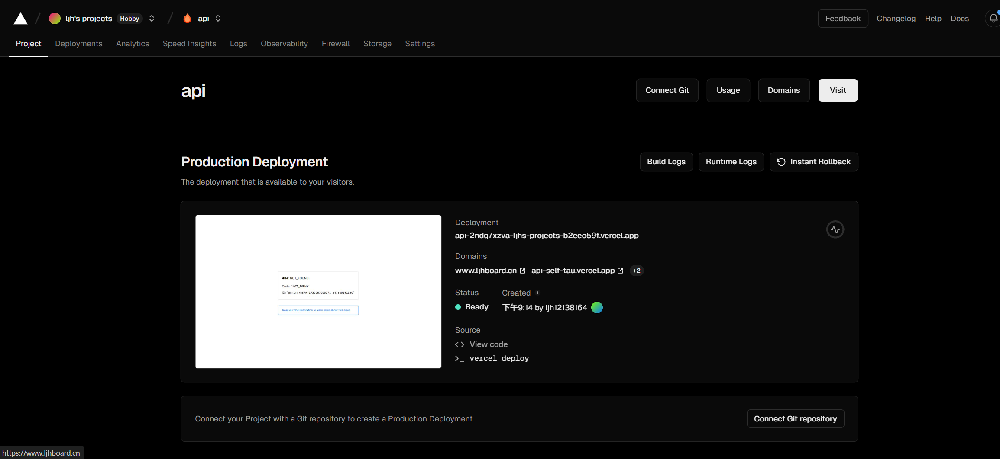

---

#### 3.获取密钥，去谷歌的工作台获取，香港节点不行，美国节点可以

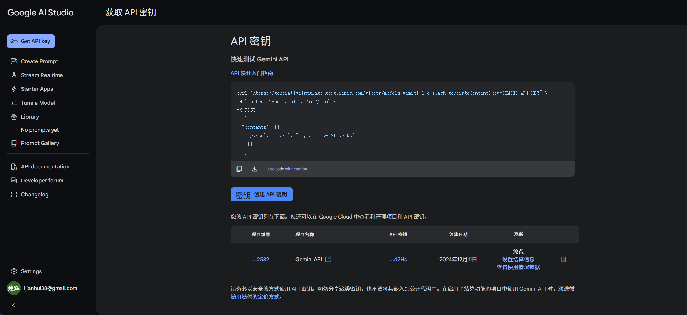

---

#### 4.配置模型,导入模型

###### 谷歌可以的模型有 gemini-1.5-flash gemini-1.5-flash-8b gemini-2.0-flash-exp（实验性的模型，后面可能会有文生图）

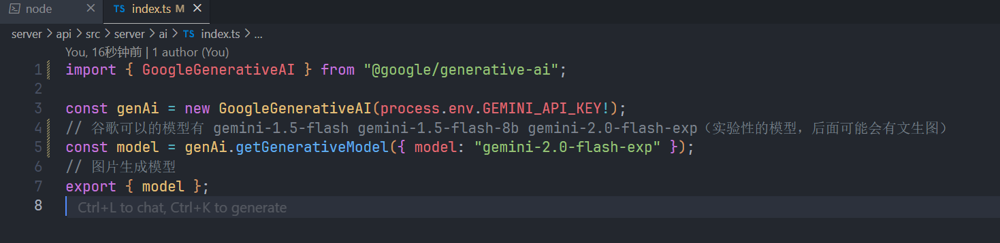

### 1.非流式回答（一次性返回）使用hono+tsup打包导入项目中，再使用react-query请求

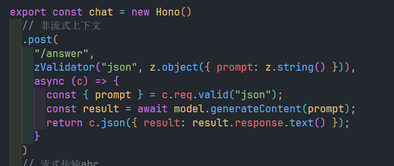

##### 属于普通的请求一样

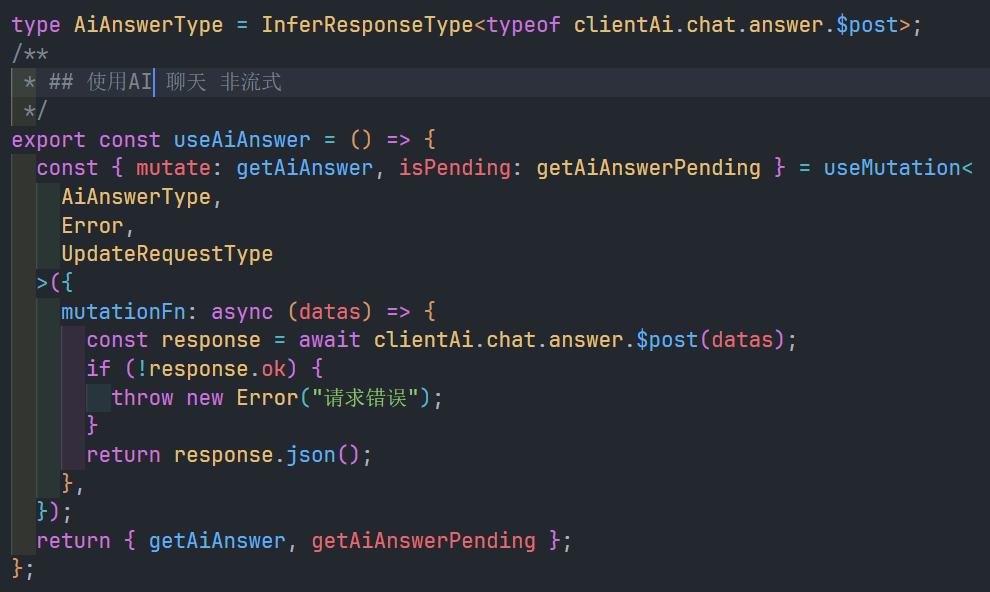 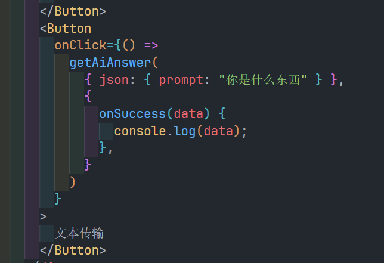

##### 返回一个对象 

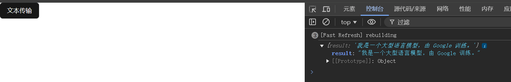

#### 2.流式回答

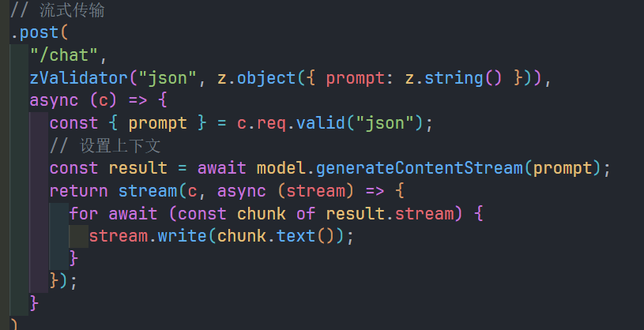

##### 返回一个流式传输的可读流，流的内容是Buffer类型

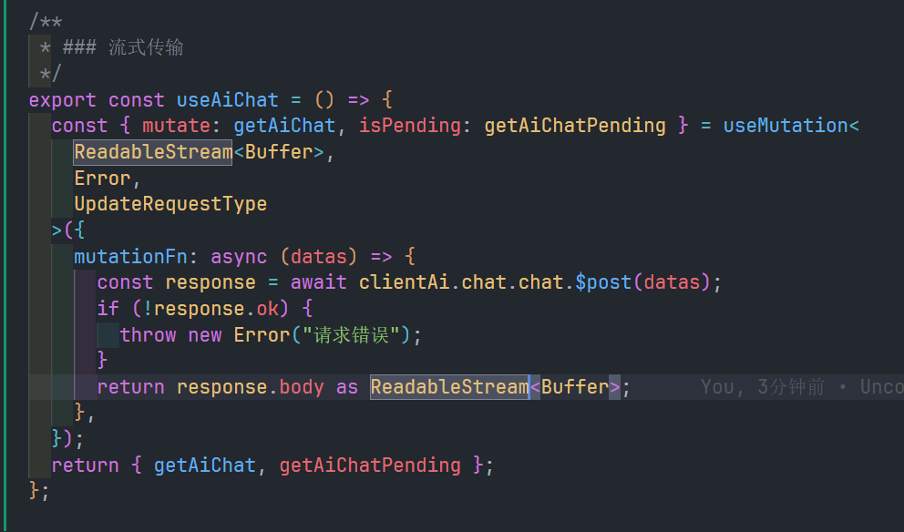

##### 递归解析可读流

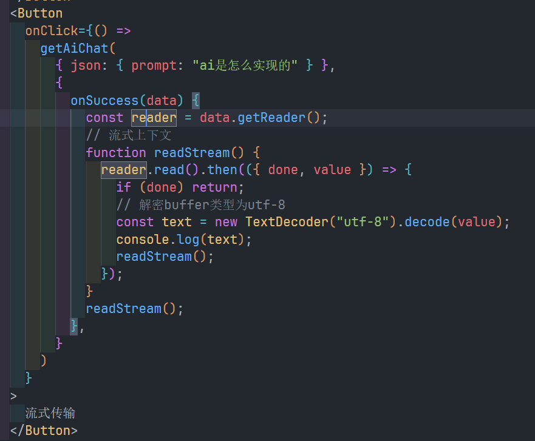

##### 返回结果

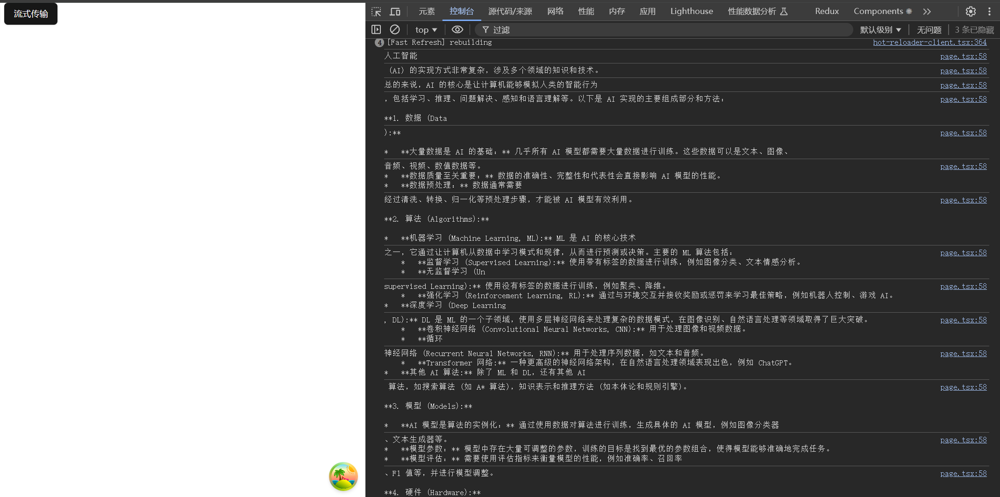

#### 3.上下文

##### 使用history参数，可以设置上下文，

参数类型

```ts
interface HistoryType {
  // 角色
  role: "user" | "model";
  // 内容
  parts: { text: string }[];
}
```

##### 使用stream流式传输和history添加上下文

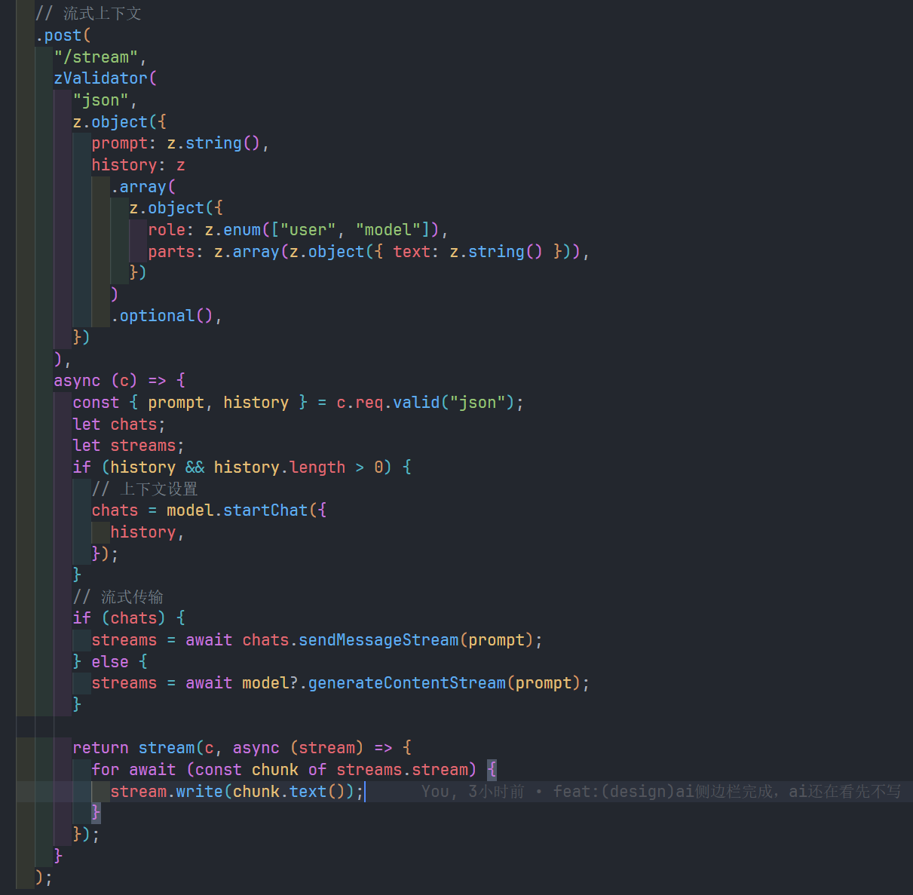

##### reactquery请求和刚刚的流式传输是一样的，添加history参数实现上下文

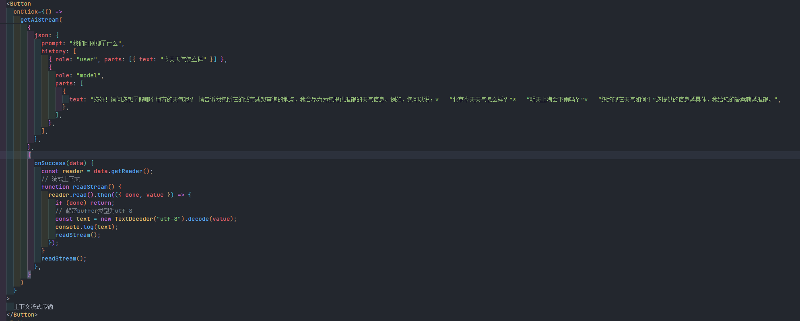

##### 返回结果

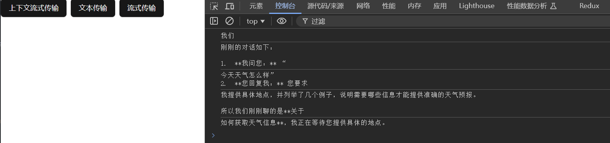

### 附记

#### 这个些模型都是属于多模态的，可以给他输入视频，图片等解析,所以可以实现的功能还挺多的，后面可以生成图片，音频等，可以期待一下

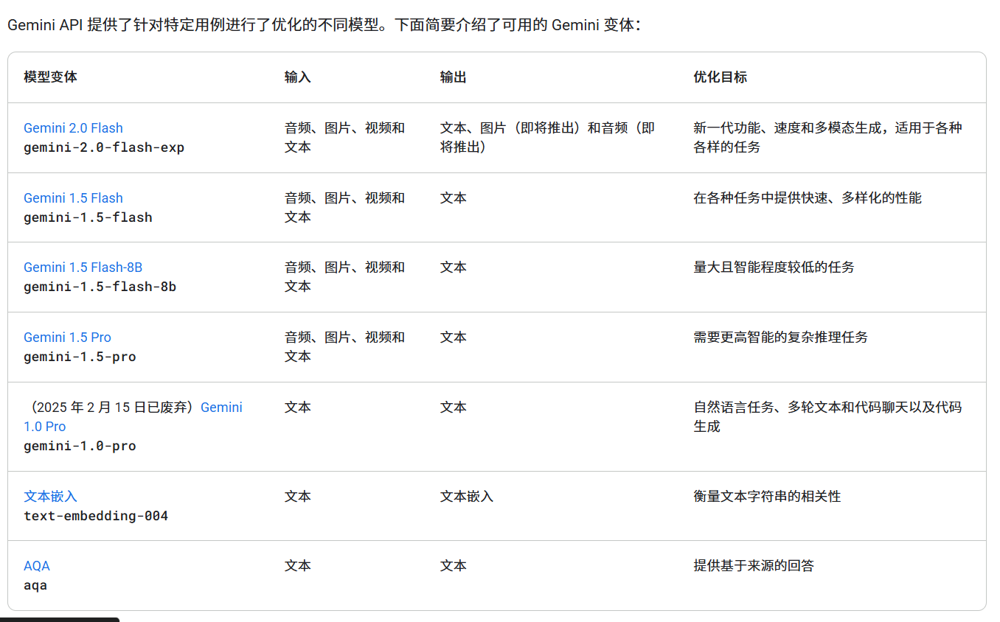

