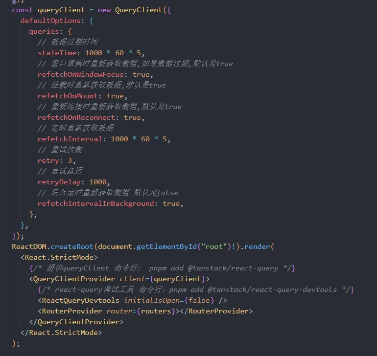
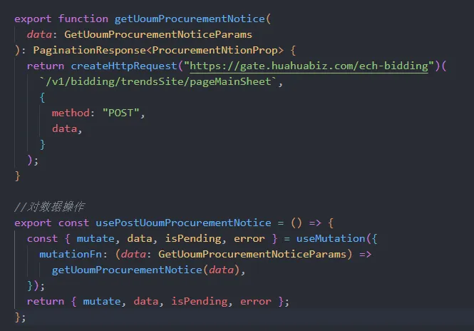
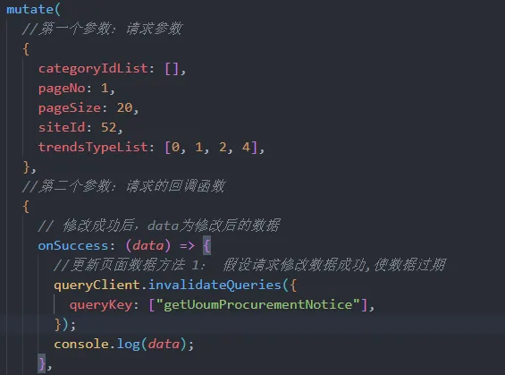

export const metadata = {
  title: 'react-query实现api优化',
  description: 'react-query实现api优化，使用@tanstack/query对react和vue项目进行优化',
}

# react-query
## 和 axios 的区别

axios 主要用于简化 HTTP 请求的发送与配置更专注于请求的发送和回复的处理。

@tanstack/react-query则是一种高级的状态管理解决方案，专门处理数据获取、缓存、同步等复杂逻辑。

## @tanstack/react-query的优点

- 自动缓存数据，减少不必要的请求。
- 提供数据的 refetch 机制，可以根据需要重新获取数据。
- 内置了加载状态、错误处理、数据过期和重新验证等功能。
- 可以轻松处理分页和无限滚动等复杂的数据获取场景。
- 统一获取数据的方式
@tanstack/react-query 可以和 axios 一起使用（下面演示）

## 开始使用

```bash
pnpm add @tanstack/react-query （主要依赖包）
pnpm add @tanstack （开发工具）
```

##   导入react-query   （在main.ts中）




### 获取数据的请求（使用的是 useQuery）

使用的公司的封装的 axios 方法，获取数据
react-query 使用 queryKey 来区分不同的请求，如果各个地方使用的这个方法，将合成为一个请求  


通过解构返回数据或的是否加载和是否错误等各种请求状态也可以像axios的响应拦截器一样处理成功或失败的回调


通过调用封装的请求方法获取数据的示例：


可以通过开发工具看到queryKey对应的请求数据及当前数据的状态


如果多个地方调用的话只会合并为一个请求，不会用多余的请求


### 更新数据

如果想要重新刷新数据，可以通过queryKey来将数据设置为过期状态，react-query将自动的发出请求
使用是react-query的useQueryClient 进行数据状态操作


每次点击按钮都会触发重新请求


### 对数据进行修改删除添加操作时使用 useMutation

还是使用之前的接口模拟数据的修改



通过解构的出参数 


通过调用mutate方法就可以发起请求


可以和获取数据一样对请求成功或失败触发回调

### 更新数据时的回调

#### 方式一：以第二个参数中的onSuccess添加回调函数


#### 方式二：和useQuery一样写在封装函数中


如果想要将页面的数据在修改成功后将最新的数据渲染在页面可以配合queryClient将数据设置为过期状态。

### 更新数据时的缓存策略

#### 方法一：配合queryClient将数据设置为过期状态。

#### 方法二：手动设置数据（可以减少请求次数,可以对返回的数据进行处理） 


### 常见查询：分页查询
将pageNo传入作为key，为每一页设置键



**问题**：当下一页请求时，data将为undefined


**优化**：可以使用设置placeholerData为keepPreviousData，当下一页的数据请求时保留上一页的数据

### 常见查询：无限滚动


再添加监听`new IntersectionObserver` 来监听是否请求下一页


### 附件：

[react-query官网](https://tanstack.com/query/latest/docs/framework/react/overview)

