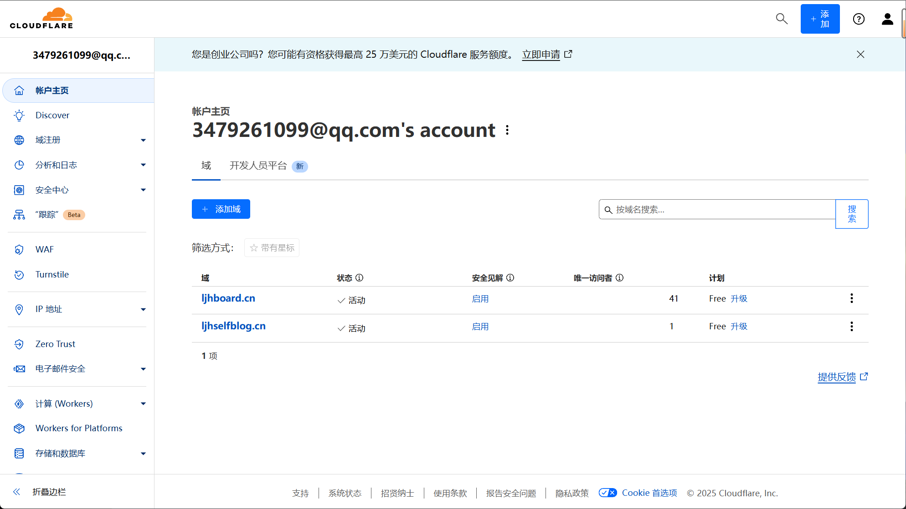
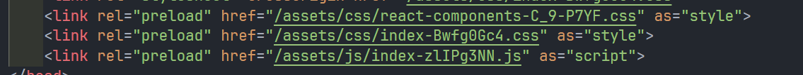
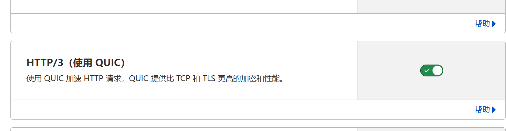

export const metadata = {
  title: 'http3和103请求头',
  description: '使用cloudflare的http3和103请求头',
};

##  添加你的域名信息到你的cloudflare首页

### 103请求头

HTTP 103 Early Hints（早期提示）是一个实验性的HTTP状态码，它允许服务器在发送主要响应之前预先发送一些资源提示。这对于优化网页加载性能特别有用。

#### Cloudflare上的103配置

1. 登录Cloudflare控制面板
2. 选择你的域名
3. 进入"Speed" > "Optimization"
4. 找到"Early Hints"选项并启用

#### 工作原理

当浏览器请求页面时，服务器可以立即返回103响应，包含关键资源的`Link`头：

#### 如：

这使得浏览器可以在接收到主要HTML响应之前就开始加载这些资源，从而：

- 减少页面加载时间
- 提高关键资源的加载优先级
- 优化首次内容绘制(FCP)

#### 性能提升

根据Cloudflare的数据，启用Early Hints可以：
- 提升LCP (Largest Contentful Paint) 20-30%
- 改善页面加载速度约100-200ms

#### 注意事项

- 目前主要支持Chrome和基于Chromium的浏览器
- 需要服务器端支持103状态码
- 建议配合HTTP/2或HTTP/3使用以获得最佳效果

### http3

通过cloudflare的优化设置，可以开启http3

### 开启http3

