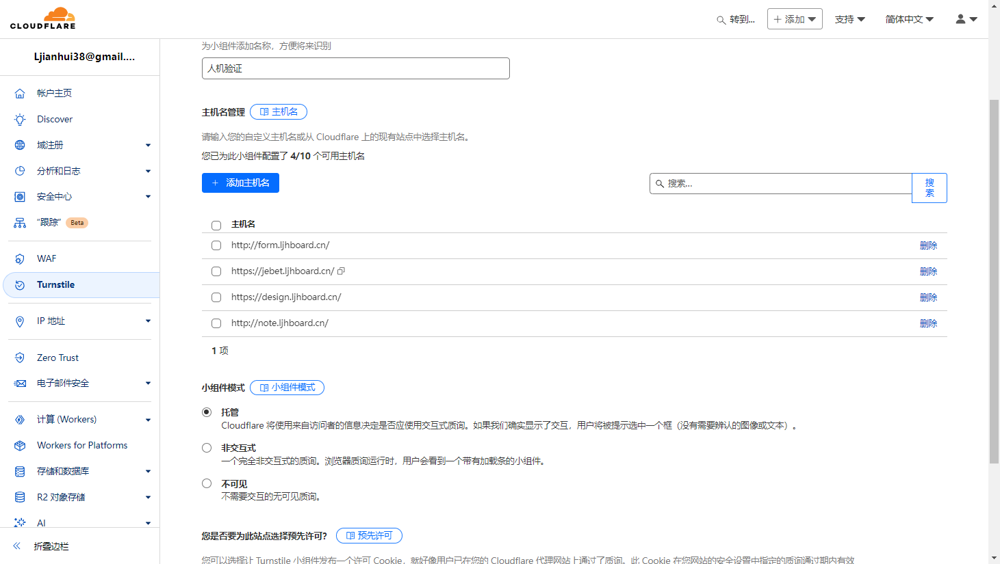
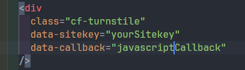
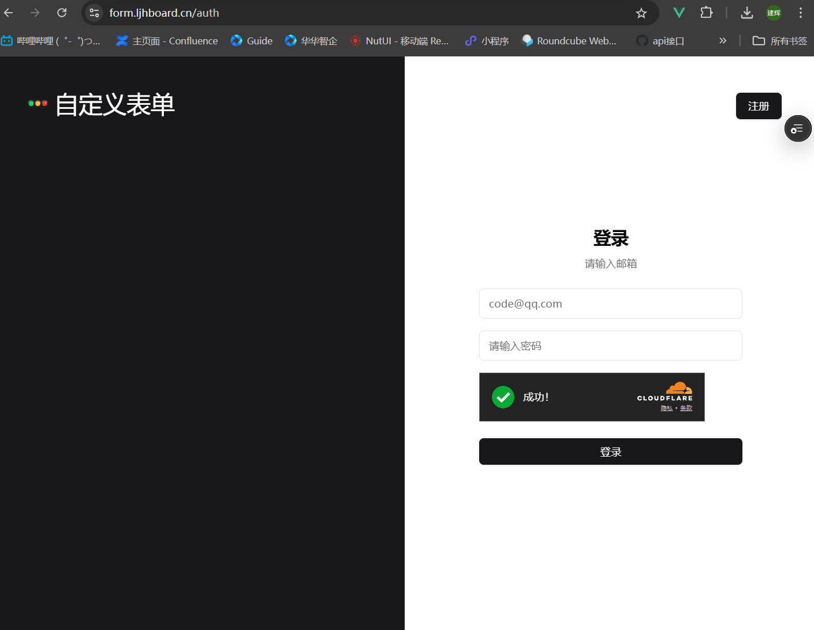

export const metadata = {
  title: '人机验证',
  description: '使用cloudflare的turnstile人机验证',
};

## 使用 cloudflare 的 turnstile 人机验证

### cloudflare 有免费的组件

### Turnstile 的优势

1. 完全免费使用
2. 对用户友好，大多数情况下无需交互
3. 支持多种主题和语言
4. 可以自定义样式
5. 有效防止机器人攻击

### 添加到登录表单页即可

### 验证流程:

1. 当页面加载时，Turnstile 会自动运行检测
2. 检测通过后会生成一个令牌(token)
3. 这个令牌会通过回调函数返回
4. 服务端需要验证这个令牌的有效性

### 上线项目结果

