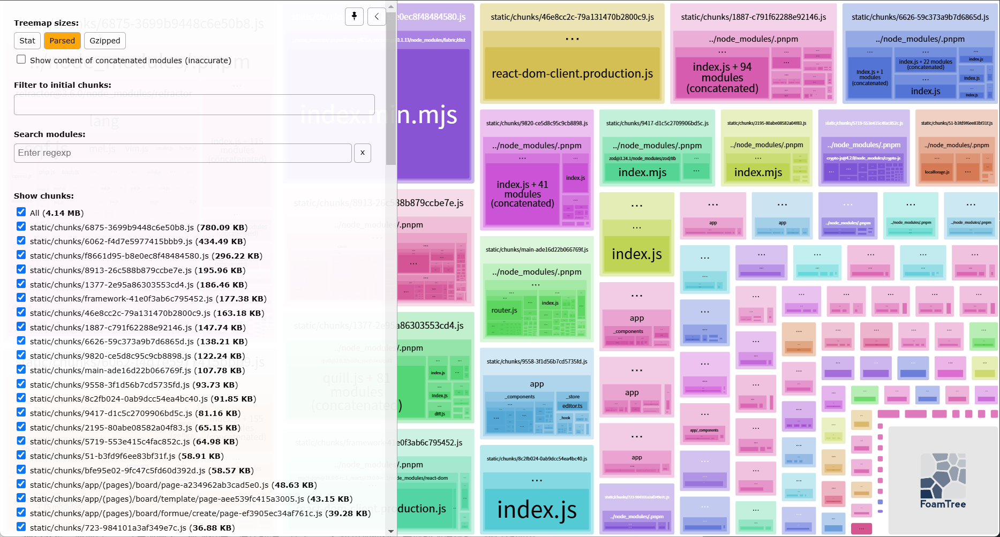
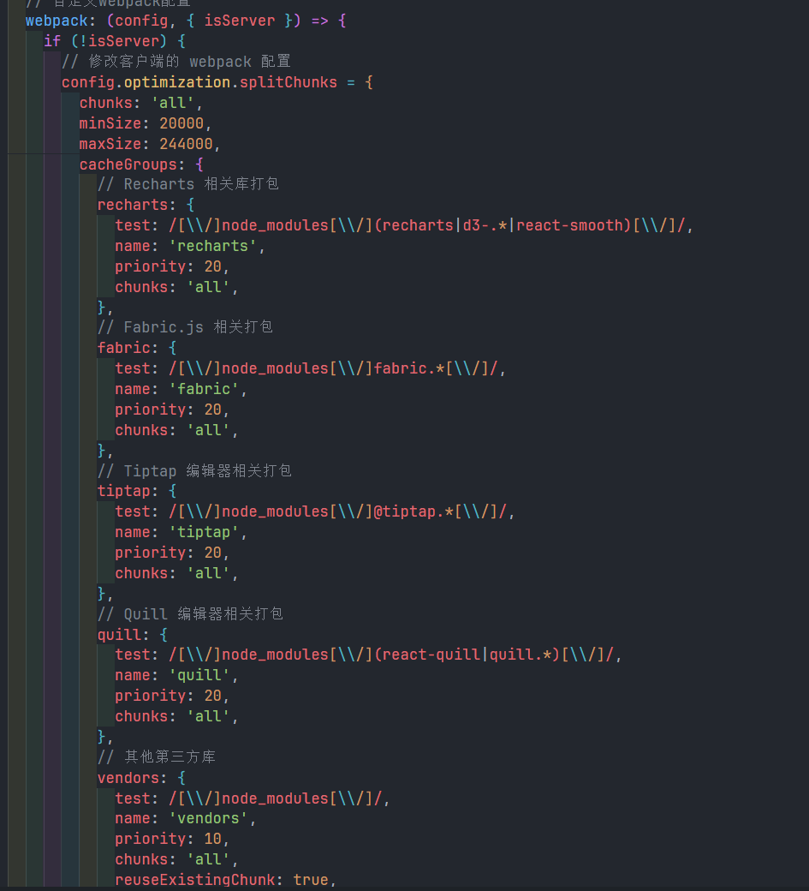
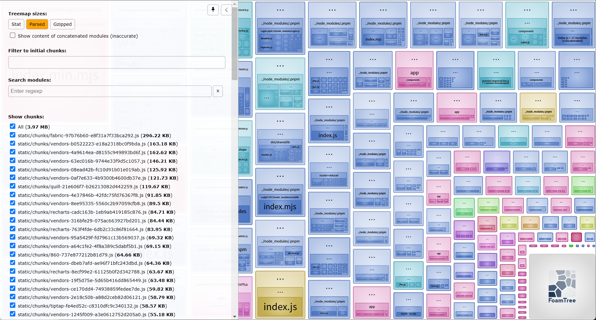
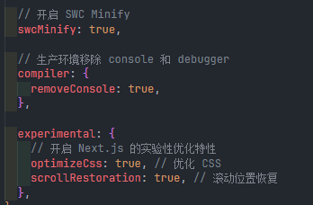

export const metadata = {
  title: 'design优化',
  description: 'design的优化记录',
};

## design

### 开始优化

- 使用loadsh-es进行树摇优化
- 使用分包策略，对使用频率高的组件进行分包（farbic.js,Tiptap,quill,）
- 分包策略对打包体积大的进行独立打包
- 去除无用依赖

### 优化后

- 使用swc进行优化
- 使用分包策略，使用实验性功能进行优化
- 内联关键 CSS 并延迟加载非关键 CSS
- 可以提高页面的首次加载性能和核心网页指标（Core Web Vitals）

