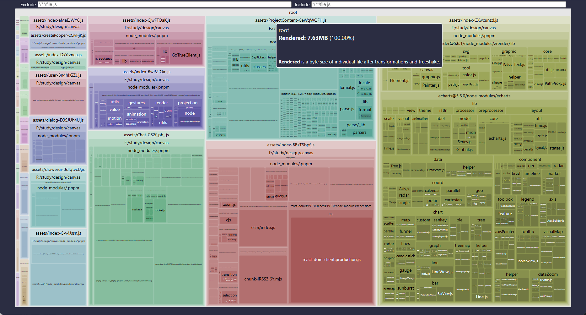
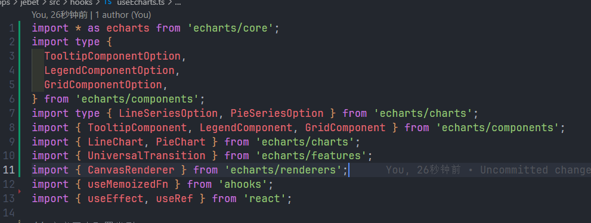
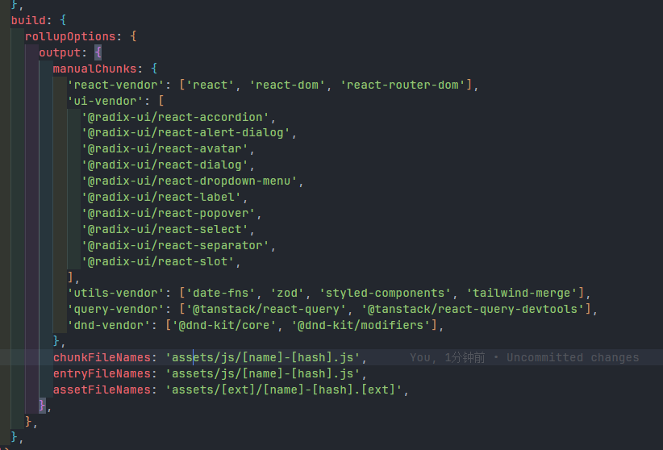
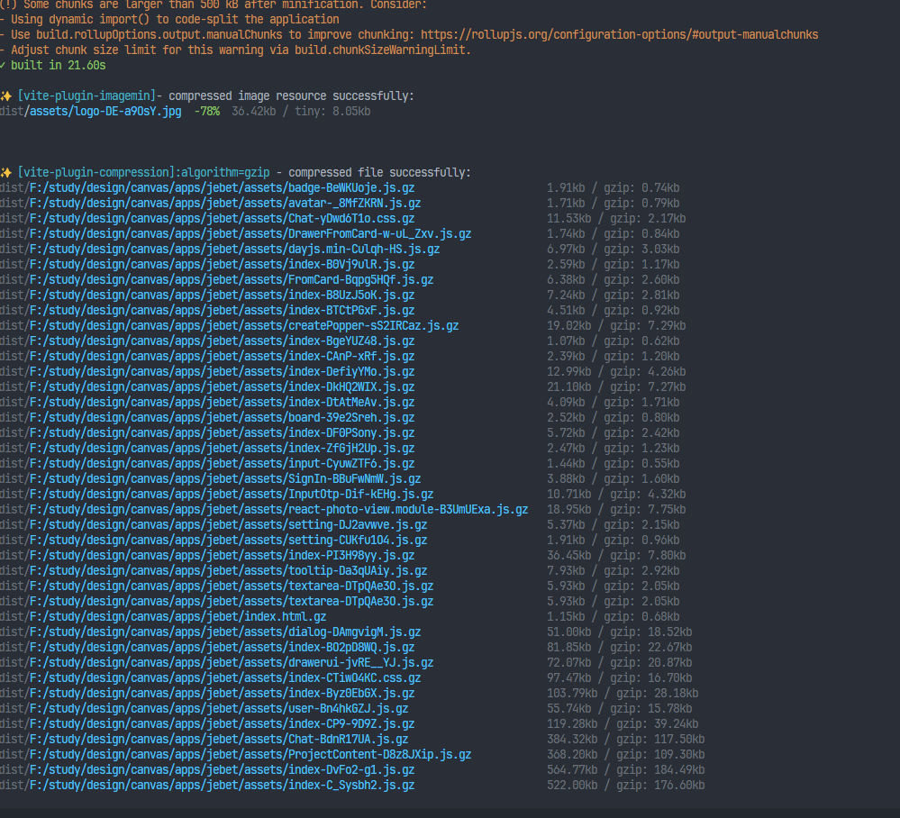
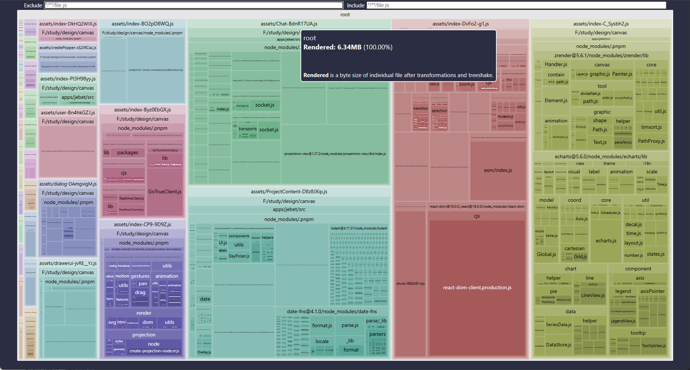

export const metadata = {
  title: 'jebet',
  description: 'jebet的项目优化记录',
}

## jebet

### 开始优化

- 未优化前的打包大小
 

### 打包分析直接7MB

- 对图片进行压缩插件处理
- 对打包产物的压缩处理
- 对echart的按需引入

- 分包策略对打包体积大的进行独立打包

### 优化后

### 优化后打包大小

