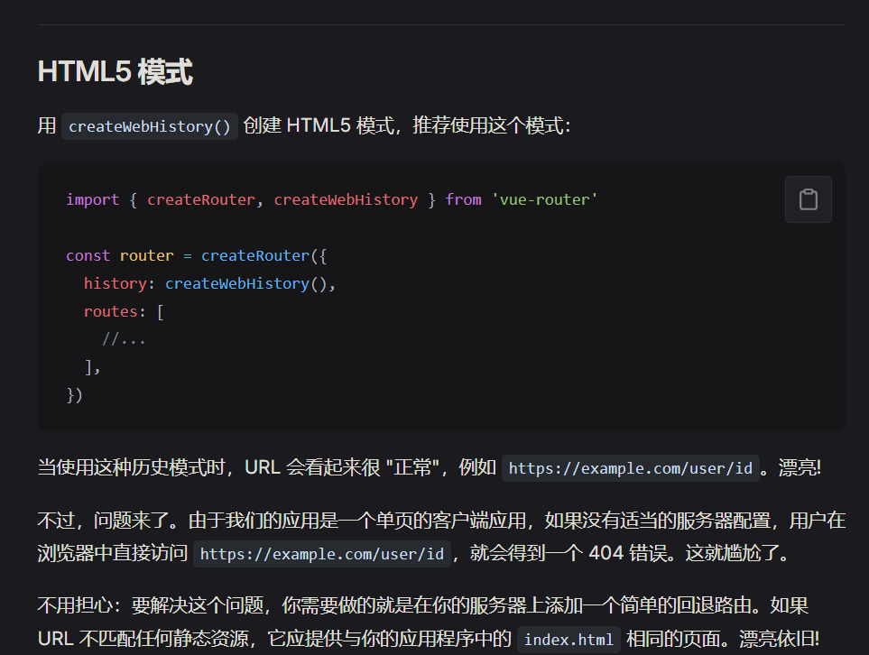
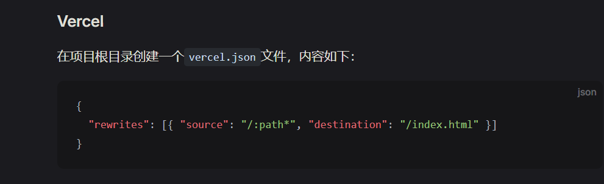
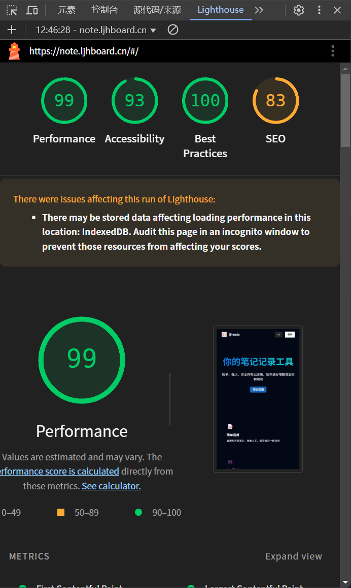
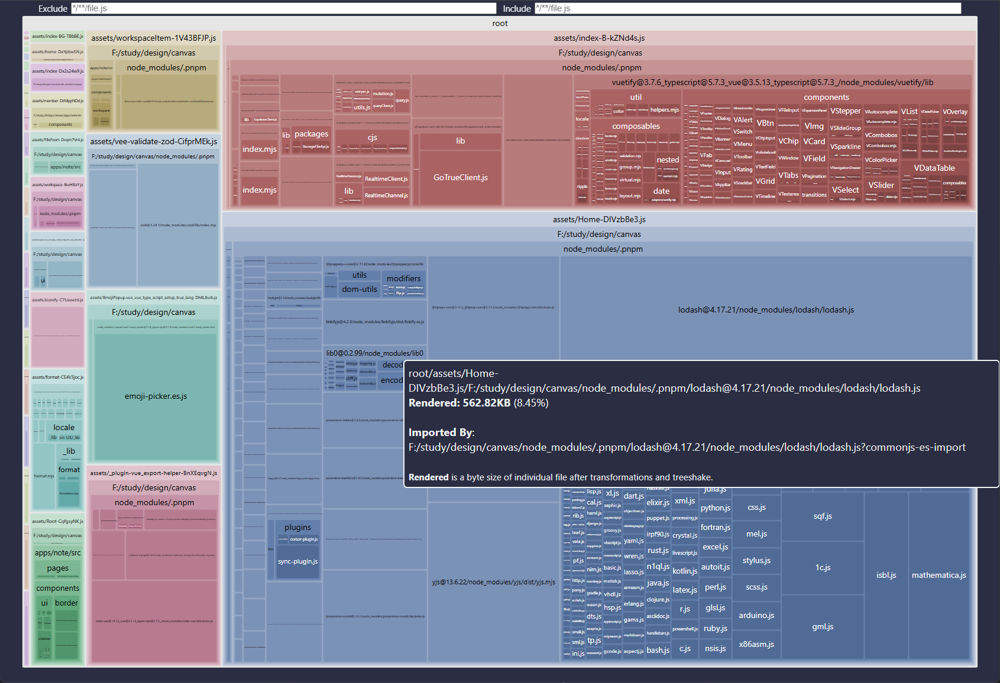
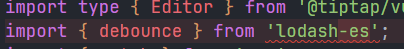
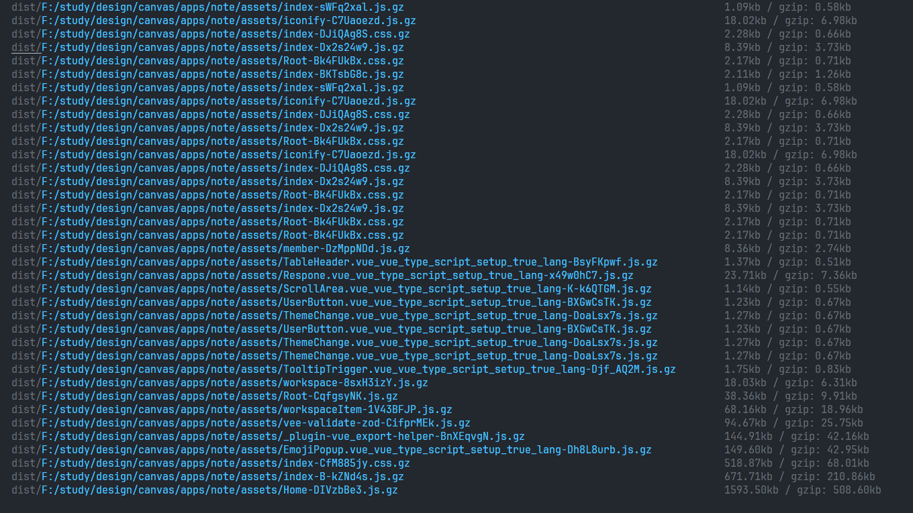
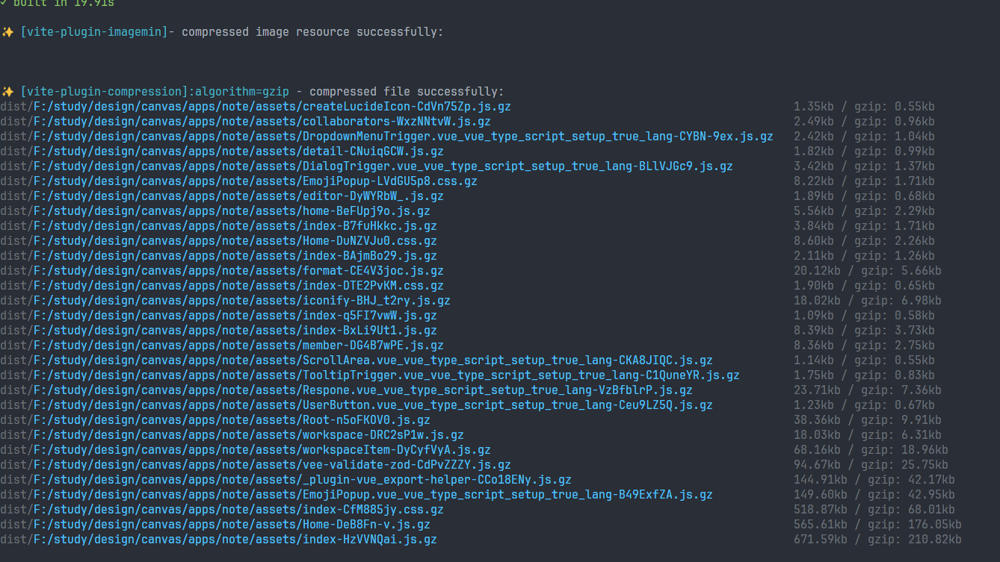
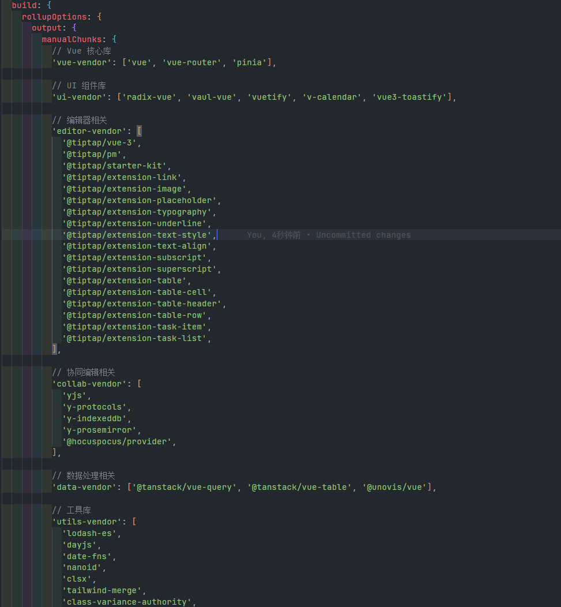
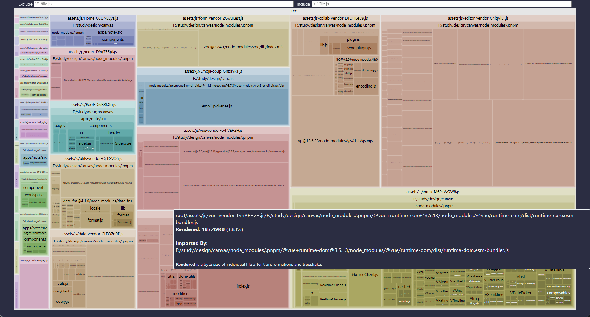

export const metadata = {
  title: '协同note',
  description: '协同note的优化记录',
}

## 协同note

- 协同note是基于note的，所以需要配置vercel.json 
因为是createWebHistory模式

- 上线后刷新出现404，需要配置vercel.json

### 1.从highthouse中可以看到优化思路

1. 无障碍优化
- 添加语言到html中
2. seo优化
- 添加title和description
- 添加robots.txt
3. 性能优化
- 打包后压缩图片
- 打包后压缩打包文件
- 查看那个打包体积打进行优化

- 优化前打包文件体积
- 优化未使用的tiptap的打包文件
- 优化lodash的打包文件（使用lodash-es）进行树摇

### 优化前

### 优化后

- 进行分包处理

- 打包结果结果比打包前好一点

