# 构建类型安全的路由

## 使用 hono 代替 Next(示例) 的路由

如果使用之前的路由模式管理的化比较麻烦

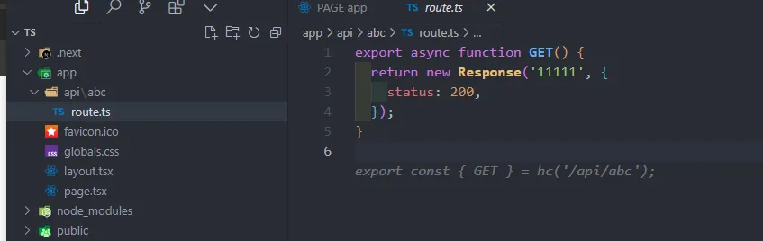

- 路由的传值没有提示
- 每个新的路由都要新建一个文件比较麻烦

### 安装 hono 和 zod 类型推导库 和 zod 的中间件

```bash
pnpm add zod hono  @hono/zod-validator
```

### 拦截全部路由进行管理并导出类型

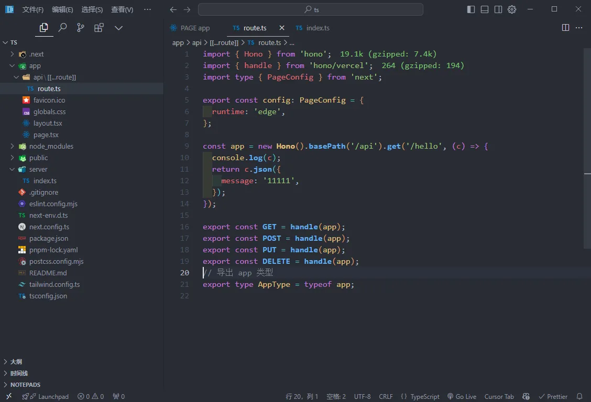

### 使用类型解析，添加基础的路由地址

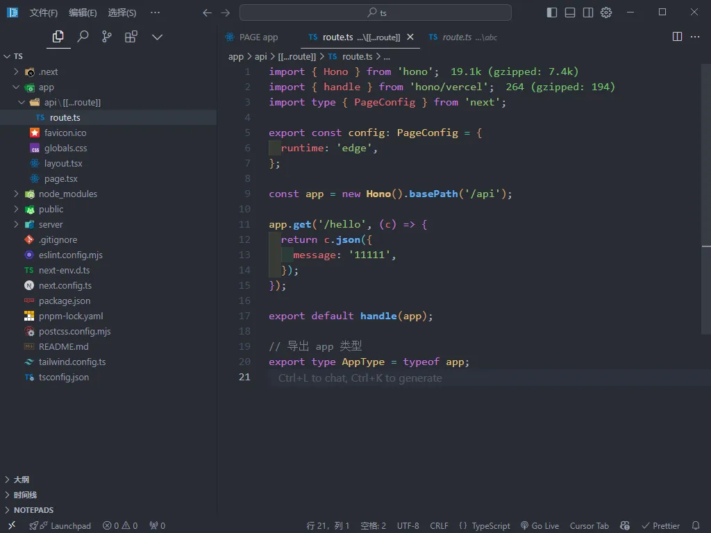  

### 调用这个方法就可直接调用 api

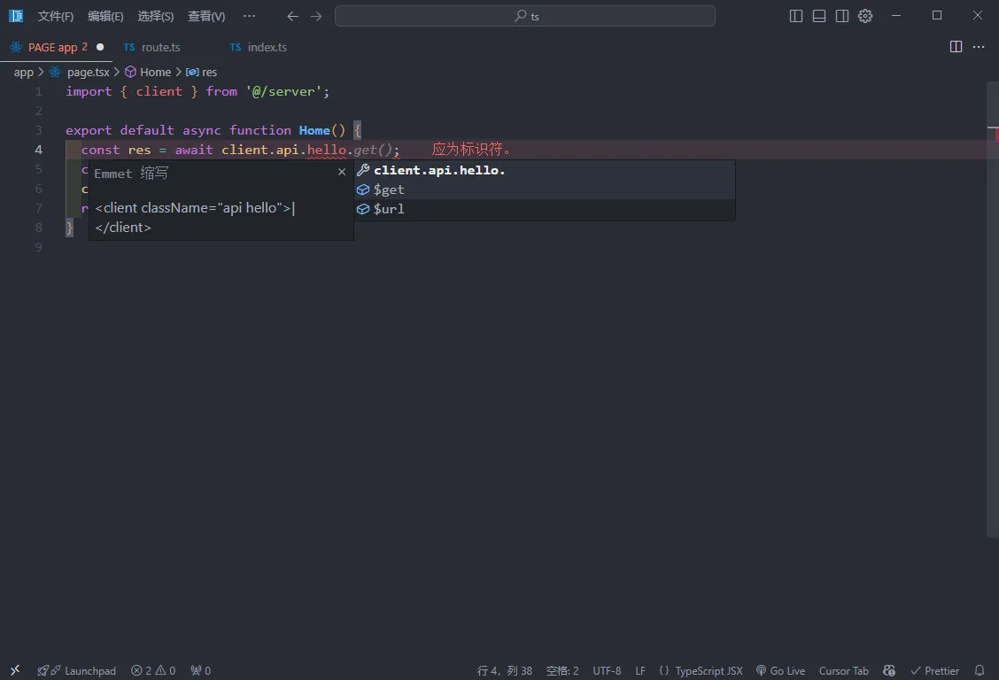

### res.ok 如果请求为 200 时为 true

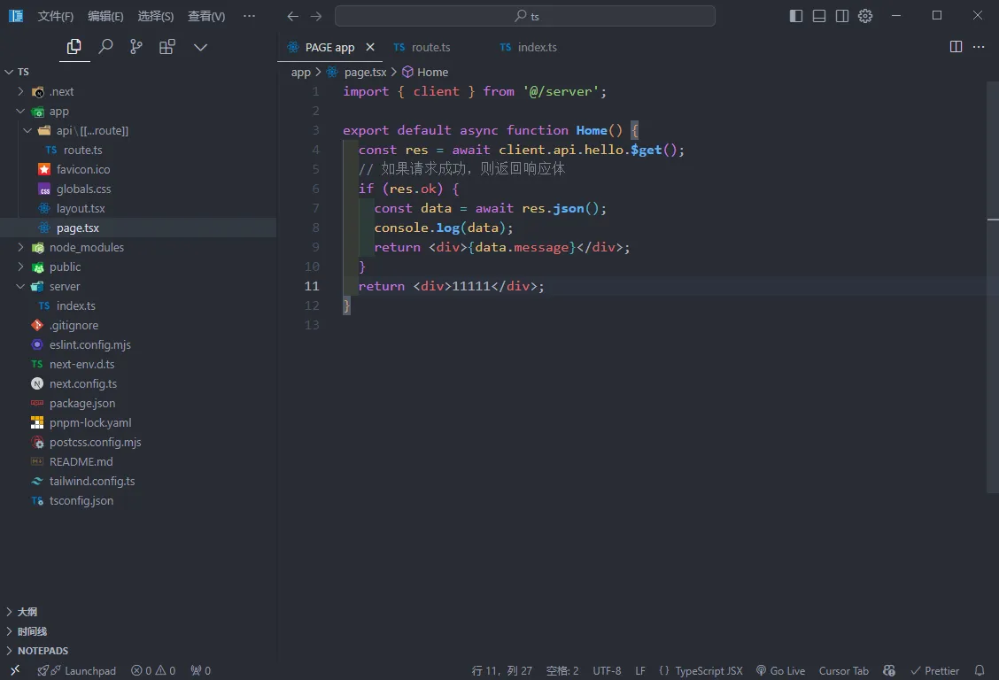

### 使用中间件 @hono/zod-validator 对请求的接口进行解析

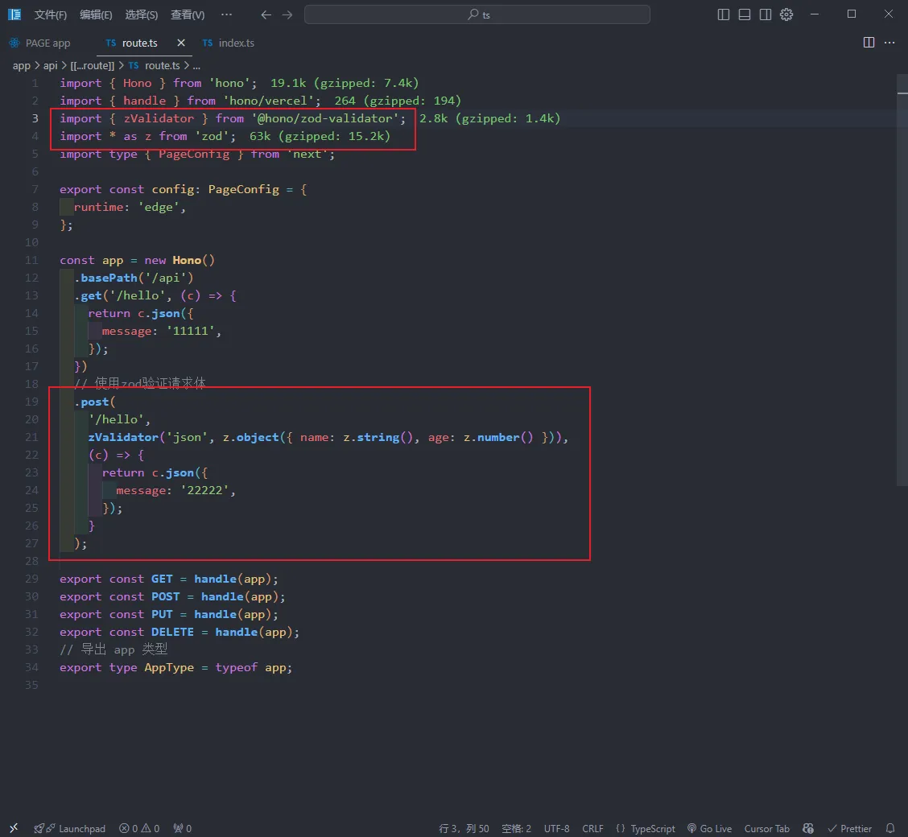

### 此时接口有了类型判断，防止了传递的参数错误

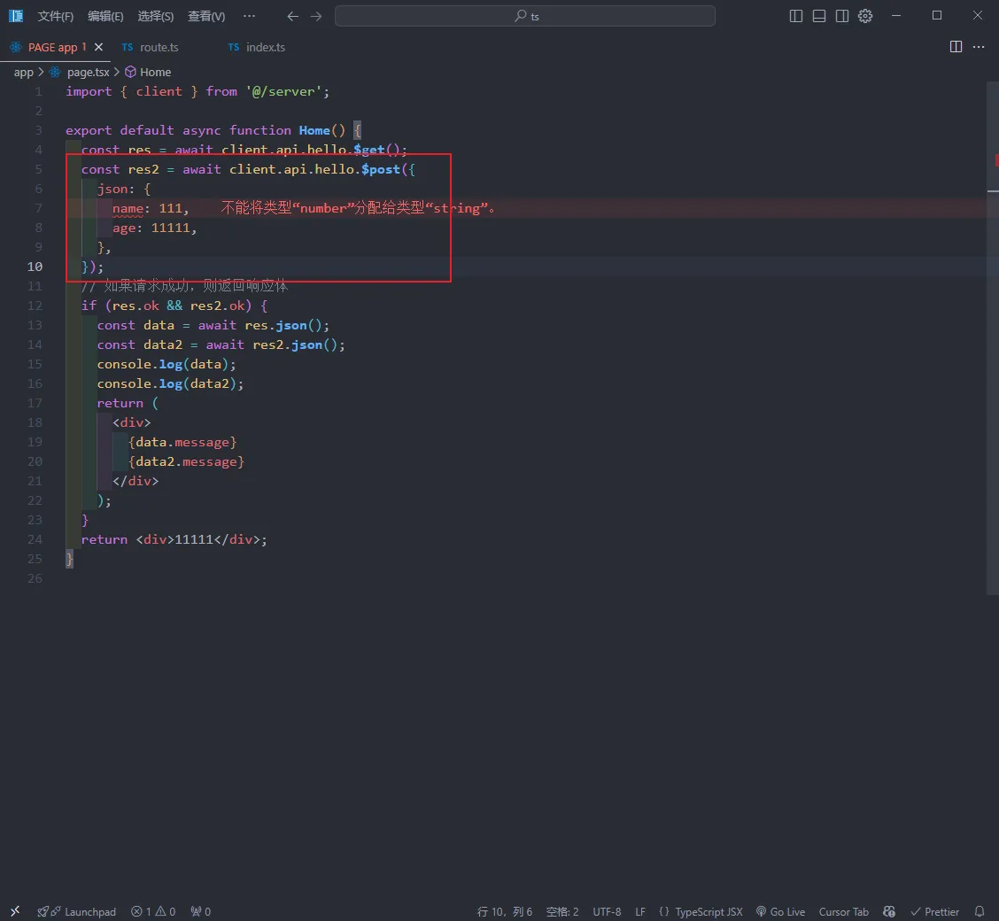

### 如果想要不同的功能模块写在不同的地方

可以和 express 一样写 route 即可

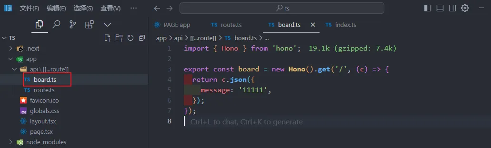
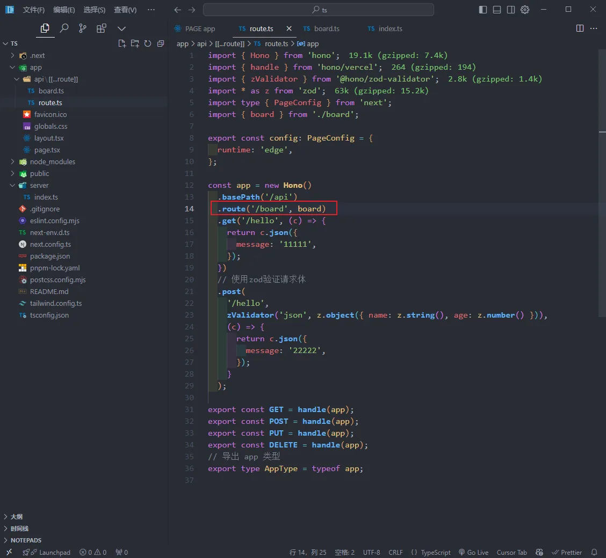


### 扩展使用 react query

使用 InferRequestType, InferResponseType 解析类型

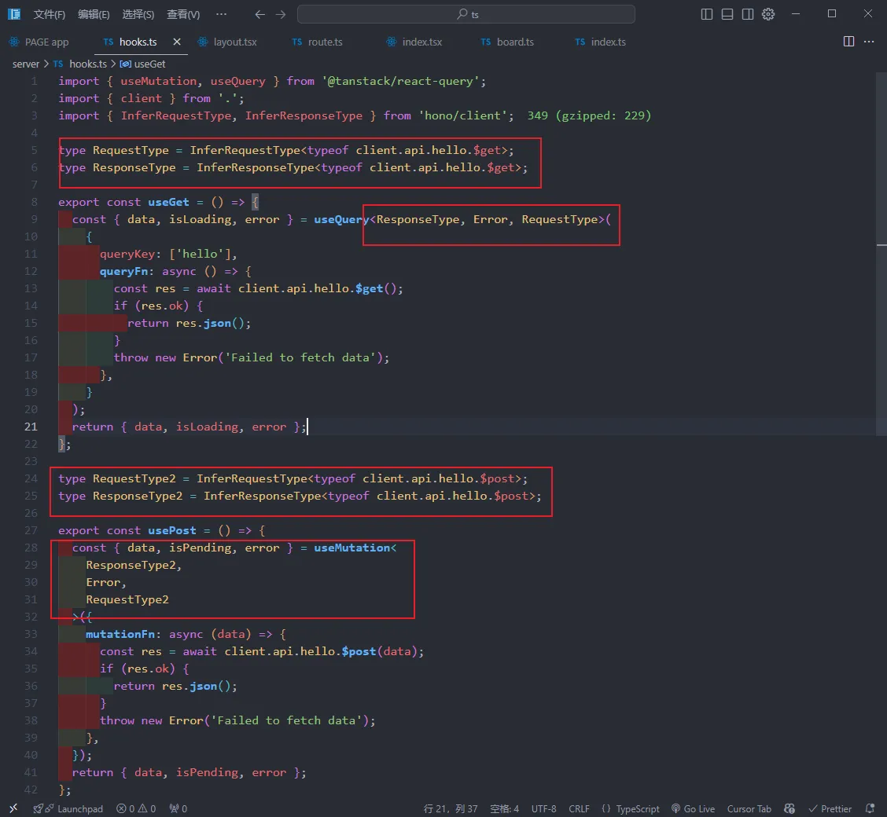
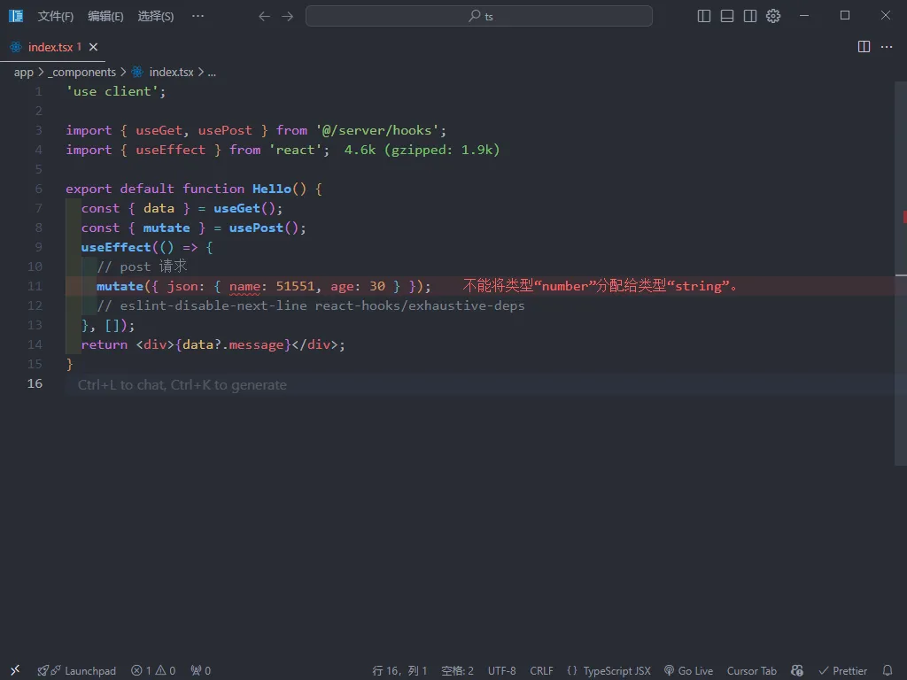


