export const metadata = {
  title: '代码提交校验',
  description: '统一仓库的检验，并在git提交时进行校验'
}

# 统一仓库的检验，并在提交时进行校验

## 基于biome实现的代码格式和代码检验（结合了eslint + prettier）

像 Prettier 一样格式化代码，但是更省时

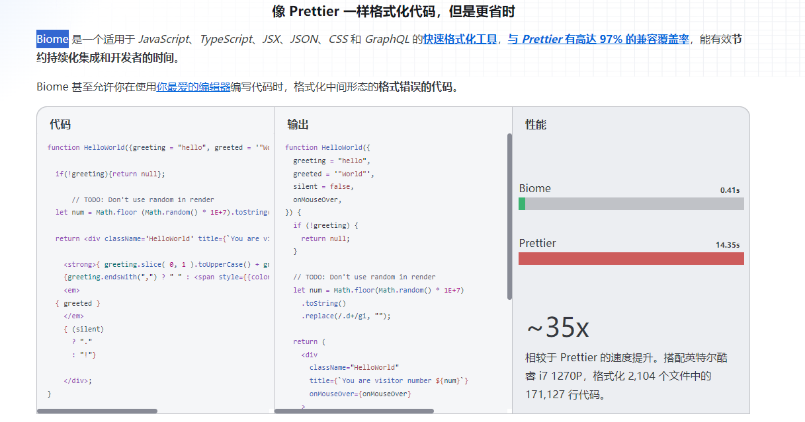

所以只要放在一个地方即可引用

 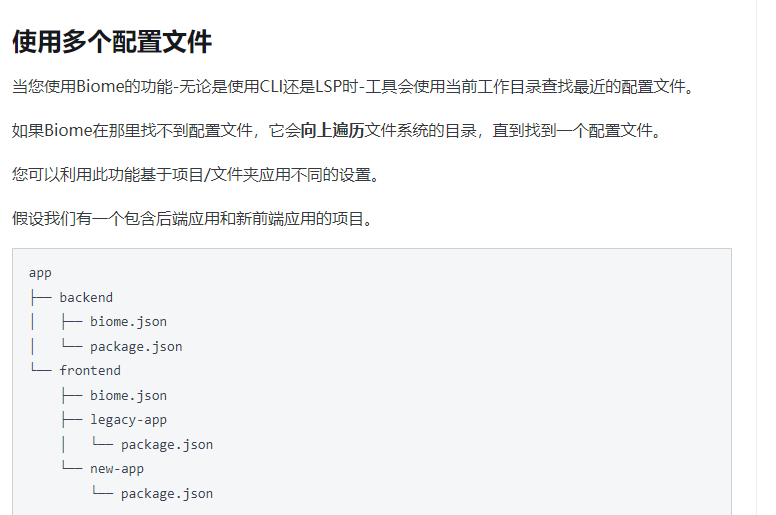

---

## git提交hook的进行校验

### husky

husky为我们提供了一系列的git hooks，用于在进行git操作时的一些预处理等等

### lint-staged(使用)

专门用于在通过 git 提交代码之前，对暂存区的代码执行一系列的格式化

### simple-git-hooks（公司使用的就是这个，使用）用这个代替husky

简易Git钩子是一款轻量级的Git钩子管理器，可以在提交或推送时自动执行自定义脚本，如格式化代码、运行测试或检查代码质量等。配合lint-staged使用

## 样式的格式化

### stylelint

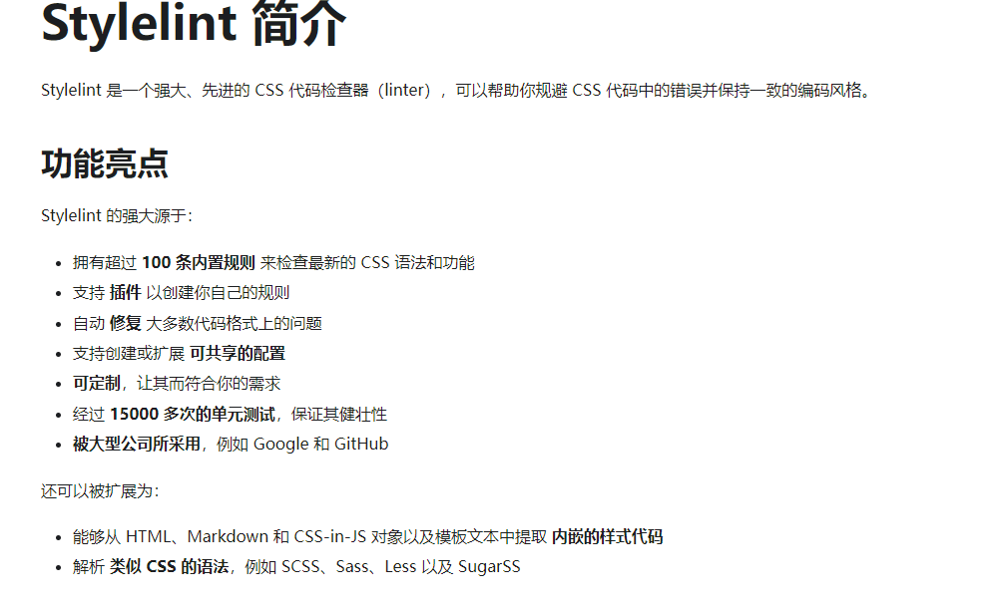

### 在项目中添加一个配置仓库

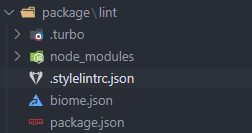

### 通过工作区引入配置项

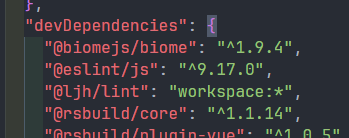

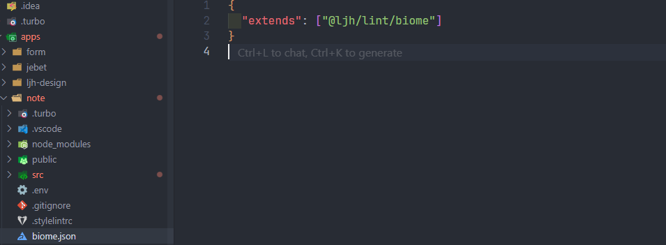

### 添加lint到项目中

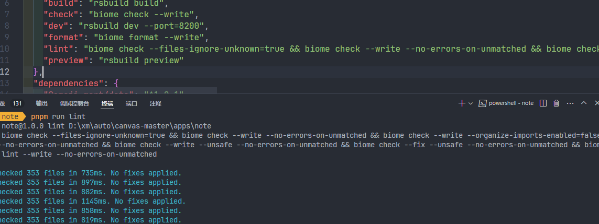

### 添加到单仓库的根路径

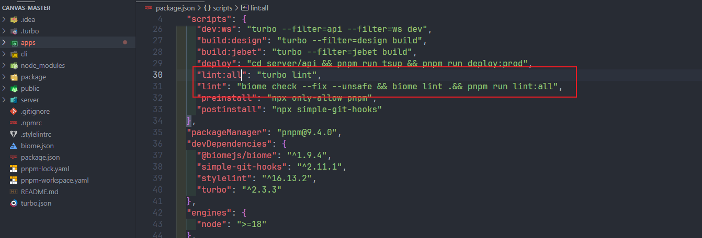

### 用turbo来启动工作区

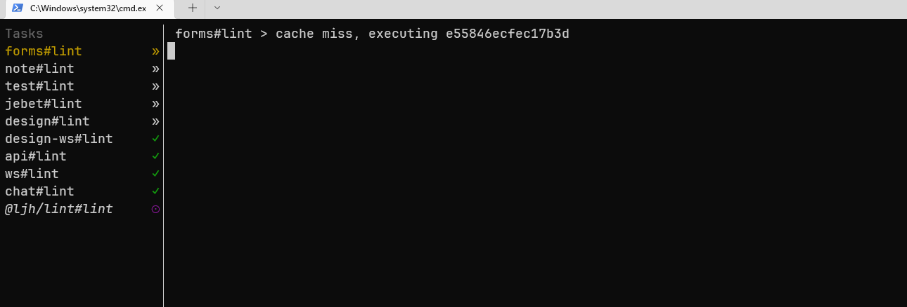

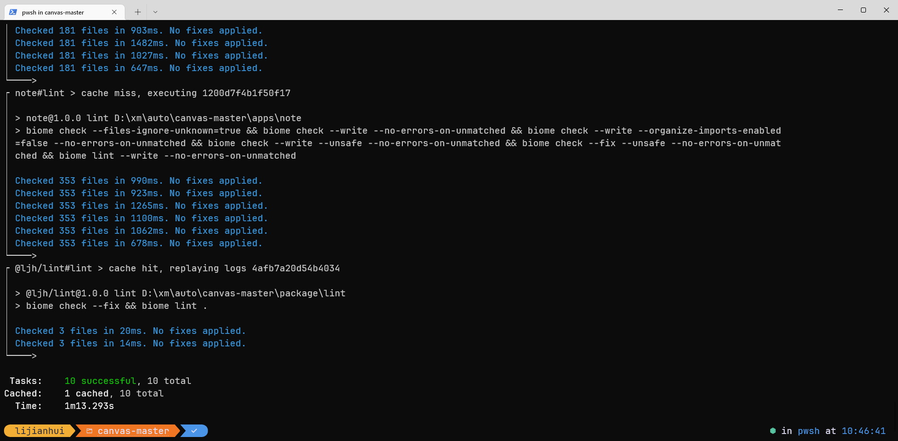

### 添加simply-git-hook配置

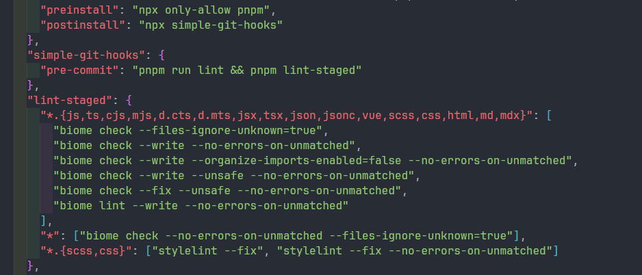

### 测试git提交

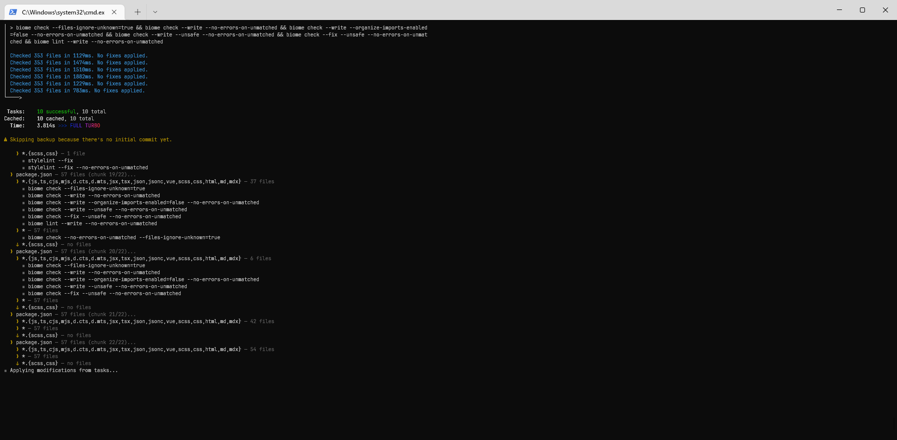