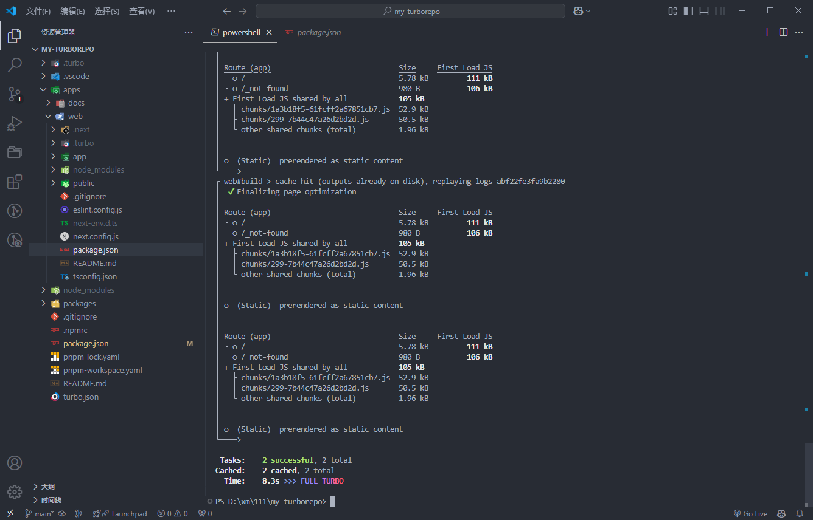

## 单仓库管理

公司的site就是通过Lerna 进行单仓库的管理和发包,但是我主要说的是turborepo这种性能更好的管理方式

### monorepo

在通用的开发场景中，人们希望各个项目之间能够足够的独立，各自的开发和发布不会产生太多的耦合，现在很多的项目也是出于这种考虑去拆成一个一个独立的子项目，在单独的代码仓库中进行管理，这就是我们常见的单代码仓库的开发模式。 但是上面的模式，在某些场景下就会显得低效和繁琐。比如一个仓库的代码被很多其他相关的仓库引用，那么只要这个仓库进行发版，所有依赖了这个代码的仓库也要跟着进行依赖升级和发版。如果把所有有依赖关系的代码都放到一个仓库中进行统一维护，当一个库变动时，其它的代码能自动的进行依赖升级，那么就能精简开发流程、提高开发效率。这种多包的代码仓库管，就是 monorepo。

### monorepo存在的问题


### Lerna （ 公司的site项目就是这个方式进行管理）

其实monorepo在前端中非常常见，Babel、Reac、Vue等开源项目都是使用这种方式在管理代码，其中 Babel 官方开源的多包管理工具 Lerna 也被广泛的使用。 

### Turborepo

Turborepo 是一个适用于 JavaScript 和 Typescript monorepo 的高性能构建工具，它不是一个侵入式的工具，你可以在项目中渐进的引入和使用它，它通过足够的封装度，使用一些简单的配置来达到高性能的项目构建。 和esbuild一样，Turborepo也是基于go实现的工具，在语言层面上就具有一定的性能优势。

### Turborepo解决monorepo存在的问题


### 安装Turborepo

通过命令安装后生成生成一个模板

```
pnpm dlx create-turbo@latest

```


### 文件目录的配置


### 引用其他的仓库可通过workspace:\*进行引入


### 可以提供node_modules看到引入的文件


### 从项目的命令行的dev就会把仓库中的全部项目一起启动


可以提供task可以看到启动了哪个项目 

### 如果要启动指定项目使用--filter过滤


### 如果build全部项目时，如果项目没有更改会跳过build直接使用缓存



## 扩展：单仓库的配置文件写在这


### --filter是根据你的package.json中的name进行匹配的


