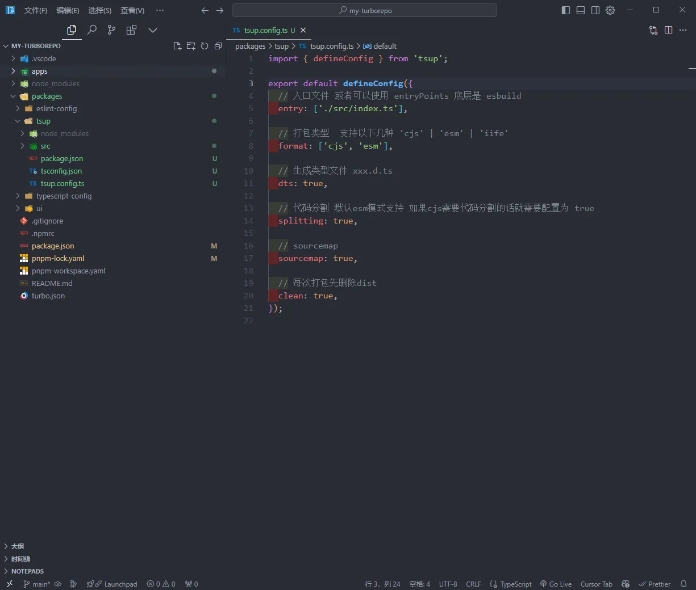
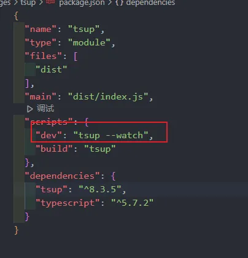
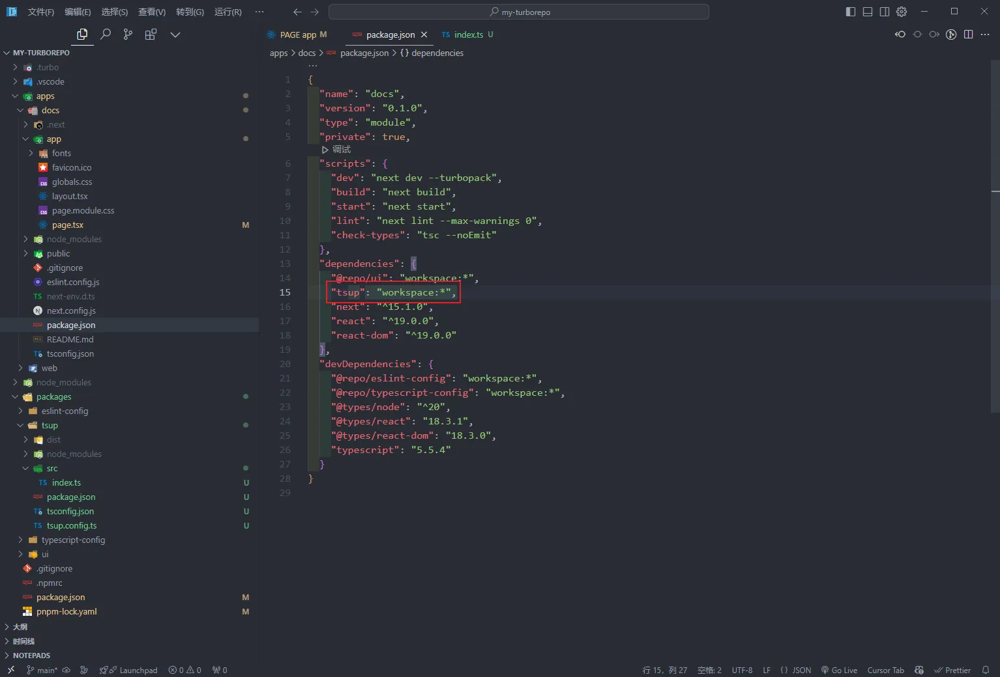
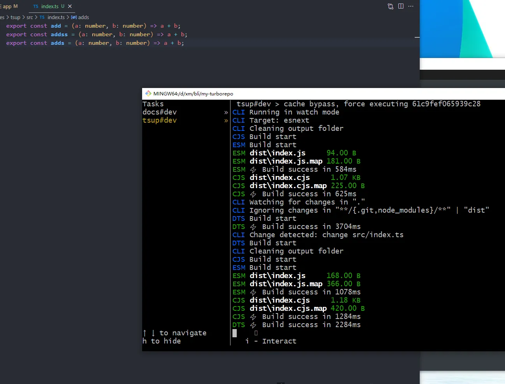

export const metadata = {
  title: '打包工具tsup',
  description: '由esbuild提供支持，无需配置即可捆绑您的 TypeScript 库。'
}

# tsup

`Tsup` 可以快速打包 `typescript` 库，无需任何配置，并且基于[esbuild] `ts` 文件速度毫秒级，方便又高效。
主打的就是低配置


## 安装
```bash
npm i tsup -D
# Or Yarn
yarn add tsup --dev
# Or pnpm
pnpm add tsup -D

```

## 还可以自动监听文件变化自动打包（添加--watch）



## 配合单仓库，可以很好的开发公用组件等



## 如果添加了新内容，就会自动的打包



## 在测试的页面就在打包后立即可用



## 从一个开源项目学到的，并成为了这个开源项目贡献者😁😁😁


pr地址：https://github.com/vantezzen/autoform/pull/145

