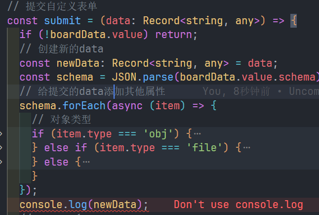
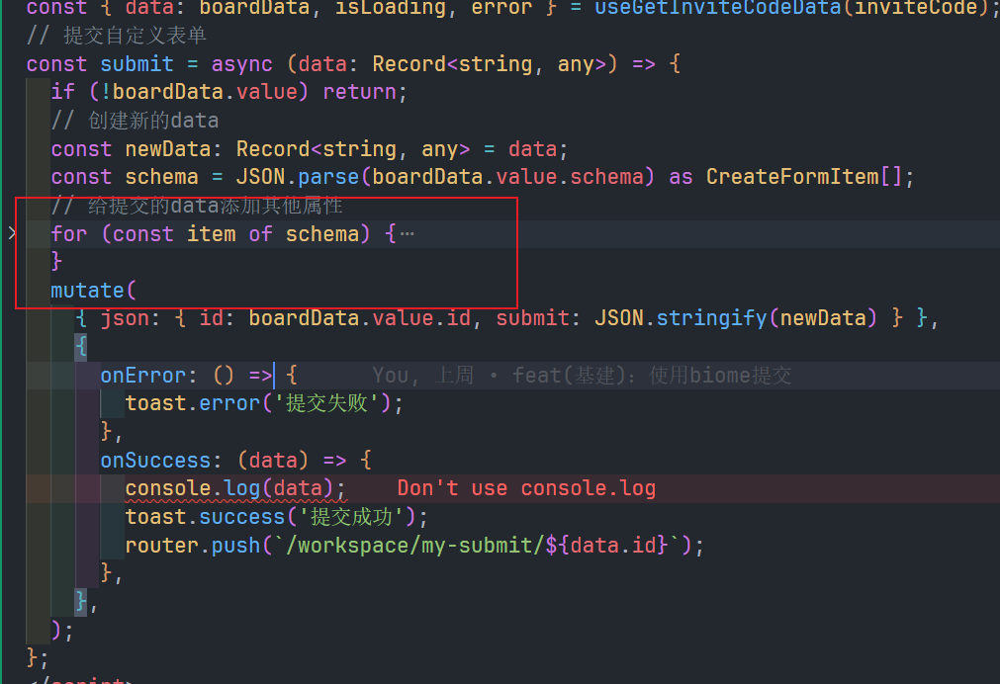
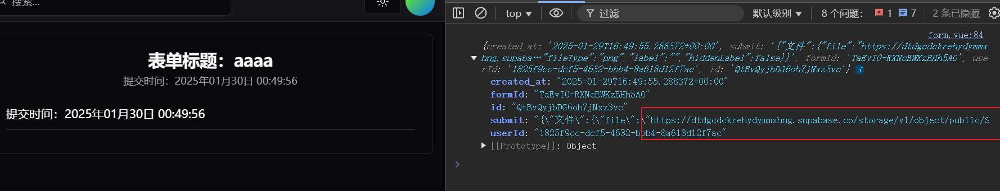

export const metadata = {
  title: '用for of替代forEach',
  description: '用for of替代forEach',
};

# 用for of替代forEach

## 终于知道为什么要用for of替代forEach了(biome的规则)

### 写文件上传时，发现用forEach不会继续异步

### 点击提交的时候不会发生异步，会跳过异步

### 解决用for of替代forEach

### 结果不会跳过异步

成功上传到了supabase的OSS中

