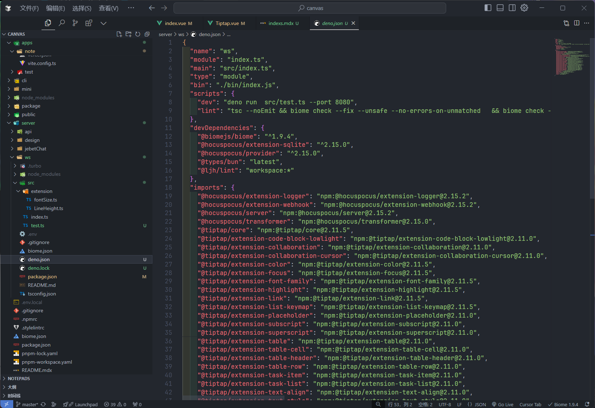
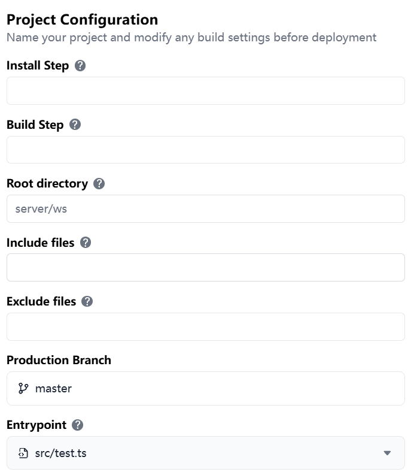

export const metadata = {
  title: '让websocket服务运行在边缘函数中',
  description: '让websocket服务运行在边缘函数中'
}

# Hocuspocus WebSocket 服务

这是一个基于 Hocuspocus 的协同编辑 WebSocket 服务器。它支持实时协作编辑,并与 TipTap 编辑器集成。

## 功能特性

- 实时协作编辑
- 支持丰富的文本格式化
- 自动保存到远程服务器
- 支持表格、任务列表等高级功能
- 可配置的 webhook 用于数据同步

## 开发环境设置

## 部署

## 使用
{/* socket.ljhboard.cn */}
