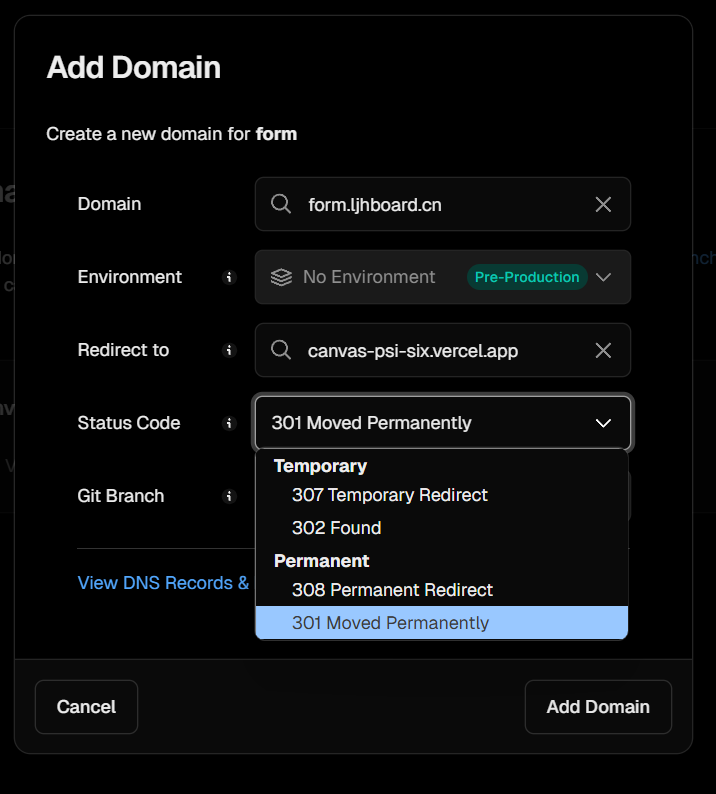

# 今天部署项目时，发现vercel的域名解析多了新的选项

### 刚好借这个机会，了解下重定向码对seo的影响

### 常见的重定向码 30X

如果是永久重定向那么浏览器客户端就会缓存此次重定向结果，下次如果有请求则直接从缓存读取，譬如我们切换域名，将所有老域名的流量转入新域名，可以使用永久重定向。
 
#### http1.0
 
- 301：永久重定向，表示资源已被永久移动到新位置，搜索引擎会更新其索引
- 302：临时重定向，表示资源暂时移动到新位置，搜索引擎可能不会立即更新其索引

301和302本来在规范中是不允许重定向时改变请求方法的（将POST改为GET），但是许多浏览器却允许重定向时改变请求方法（这是一种不规范的实现）。

#### http1.1

- 307：临时重定向，表示资源暂时移动到新位置，搜索引擎可能不会立即更新其索引
- 308：永久重定向，表示资源已被永久移动到新位置，搜索引擎会更新其索引

 307和308的出现也是给上面的行为做个规范，不过是不允许重定向时改变请求方法。

### 网址URL劫持

由于搜索引擎排名算法只是程序而不是人，在遇到302重定向的时候，并不能像人一样的去准确判定哪一个网址更适当，这就造成了网址URL劫持的可能性。
也就是说，一个不道德的人在他自己的网址A做一个302重定向到你的网址B，出于某种原因， Google搜索结果所显示的仍然是网址A，但是所用的网页内容却是你的网址B上的内容
因为301与302的区别，所以导致产生302网址劫持，故不建议使用302重定向（然而浏览器默认是使用302重定向）

# 所以，301和308是更好的选择，最好就是不搞重定向
