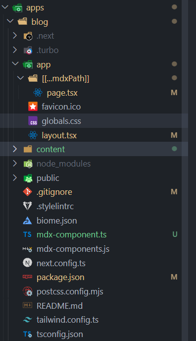
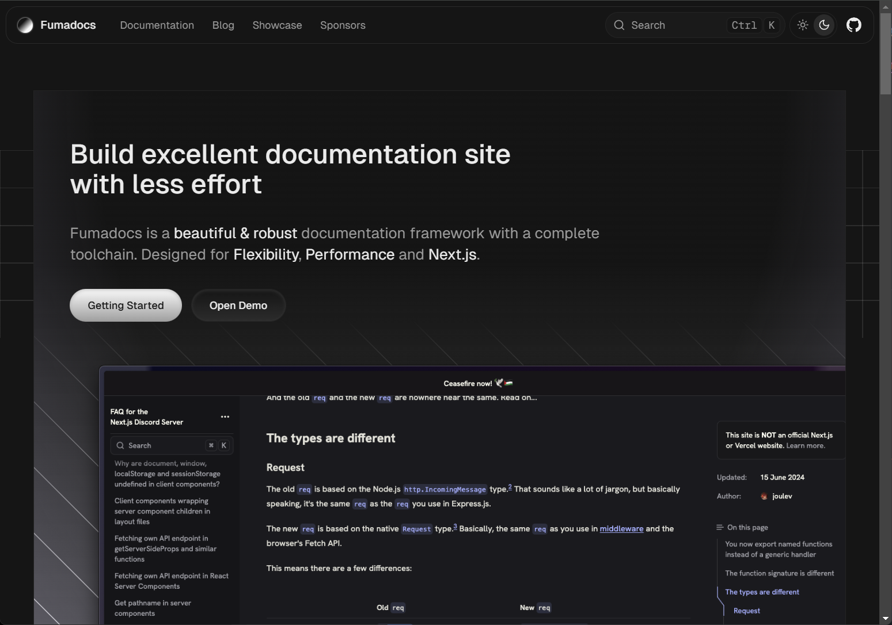
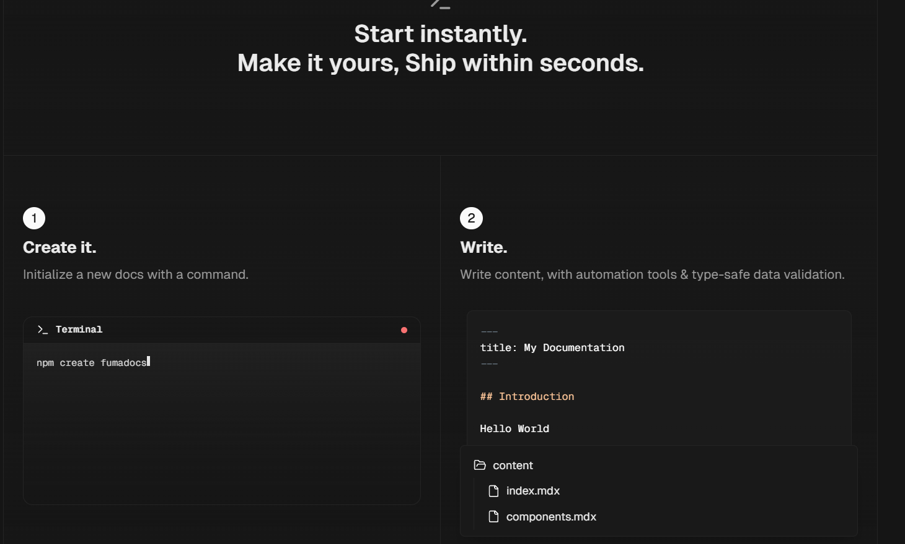
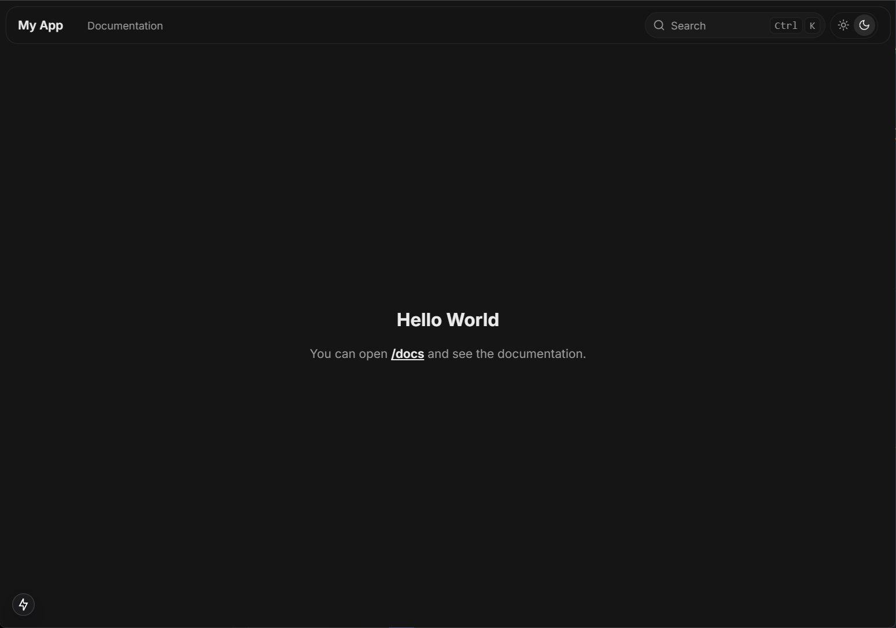
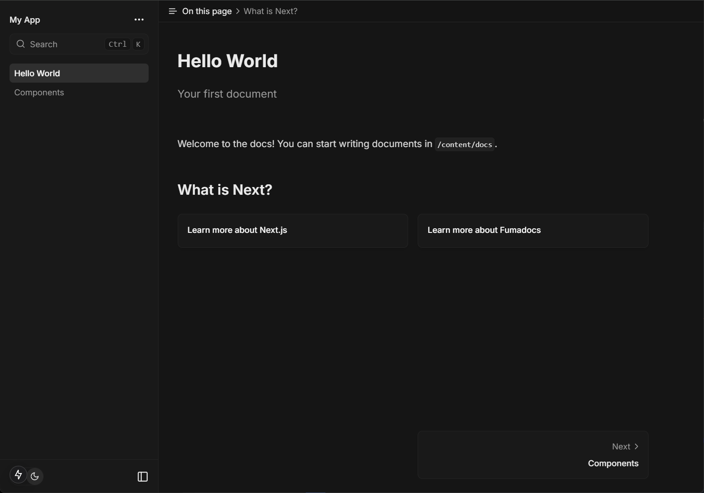
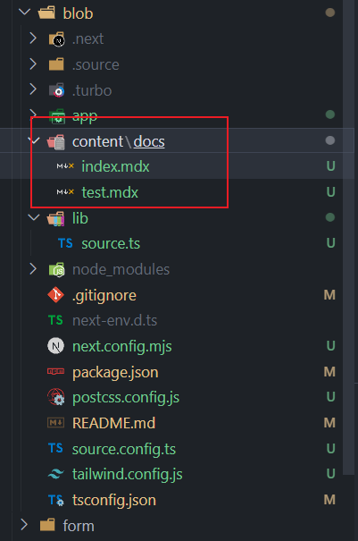

export const metadata = {
  title: '怎么吧md文件渲染为html网页',
  description: '怎么吧md文件渲染为html网页,也就是本博客的实现'
}

### 方案1：nextra生成next的静态页面

（因为Fumadocs的路由有问题使用中文会报错）

#### 用法和Fumadocs差不多

### 方案2：Fumadocs

Fumadocs 将您的md转换为数据 - 让您可以非常轻松地在应用中导入 MD(X) 和 CMS 内容

#### 步骤

#### 安装模板即可使用

 使用自动化工具和类型安全的数据验证编写内容。

#### 直接使用`pnpm run dev`即可

#### 在docs路径即可看到

#### 页面对应数据对应content里面的md文件

