### **基于zod和veevalidate的表单生成器**

使用zod可以为多个字段生成类型，使用veevalidate可以为多个字段生成验证规则，可以满足大部分表单的需求。 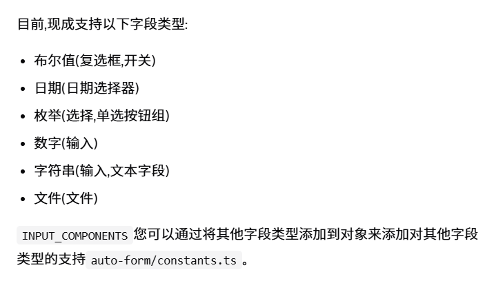

#### z.describe

可以为字段添加描述，veevalidate 可以为字段添加验证规则，可以满足大部分表单的需求。 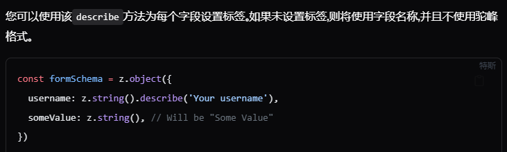

#### z.optional

可以为字段添加可选，veevalidate 可以为字段添加验证规则，可以满足大部分表单的需求。 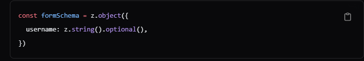

#### z.default

可以为字段添加默认值，veevalidate 可以为字段添加验证规则，可以满足大部分表单的需求。 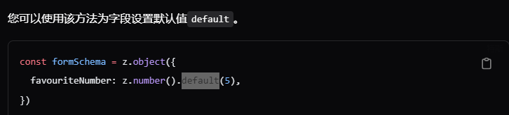

#### z.enum

可以为字段添加数组类型，veevalidate 可以为字段添加验证规则，可以满足大部分表单的需求。 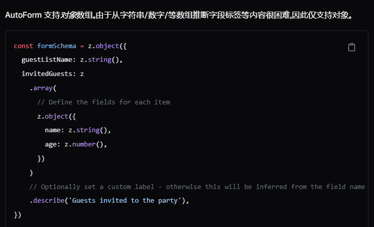

#### z.object(z.object) 嵌套

可以为字段添加子对象，veevalidate 可以为字段添加验证规则，可以满足大部分表单的需求。 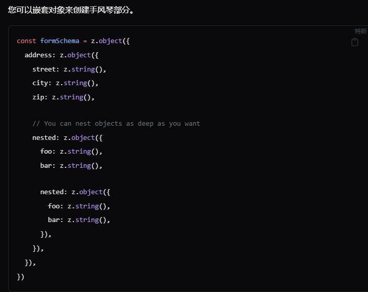

---

### AutoForm

#### 字段配置

由于 zod 不允许向模式添加其他属性，因此您可以使用fieldConfigprop 为每个字段的 UI 添加其他配置。 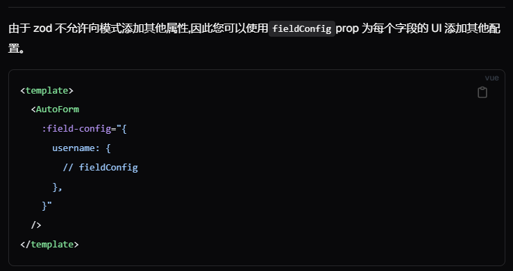

#### 自定义标签

如果您想通过Zod 的描述覆盖预定义的标签，您可以使用该属性来自定义标签。 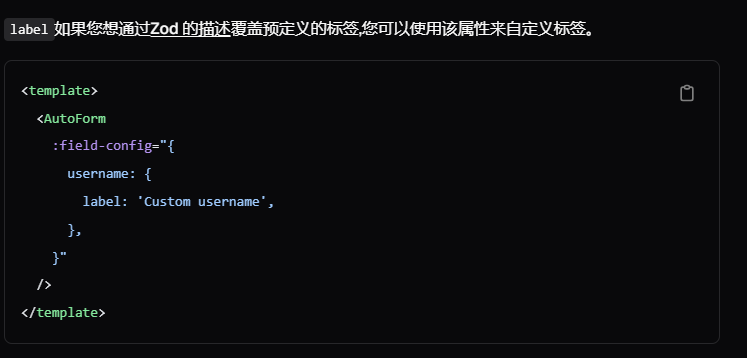

#### 自定义描述

您可以使用该属性来自定义描述。 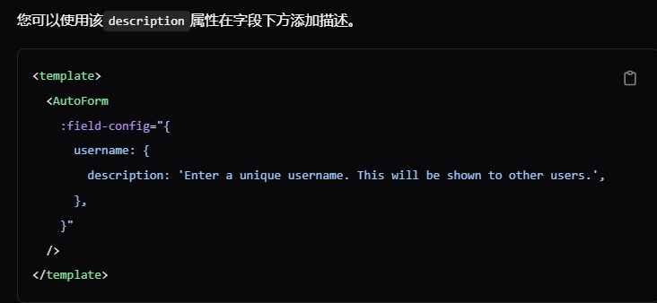

#### 自定义属性

您可以使用该属性来自定义属性。 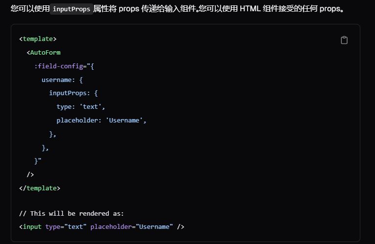

#### 自定义组件

您可以使用该属性来自定义组件覆盖默认组件。默认组件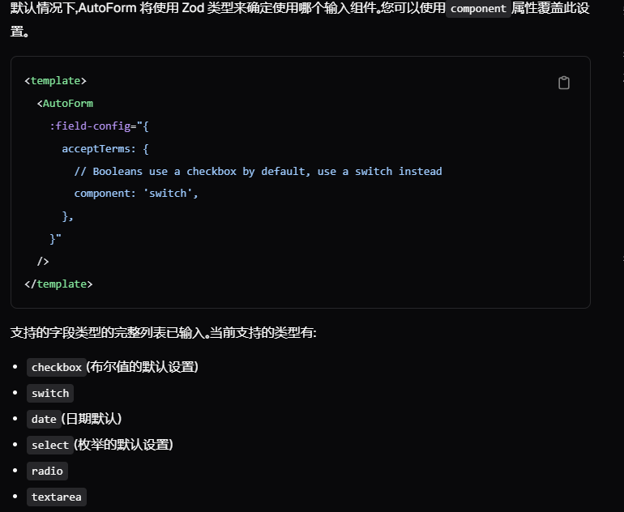 。 [示例](https://www.shadcn-vue.com/docs/components/auto-form.html#component)

#### 自定义渲染

您可以使用该属性来自定义渲染。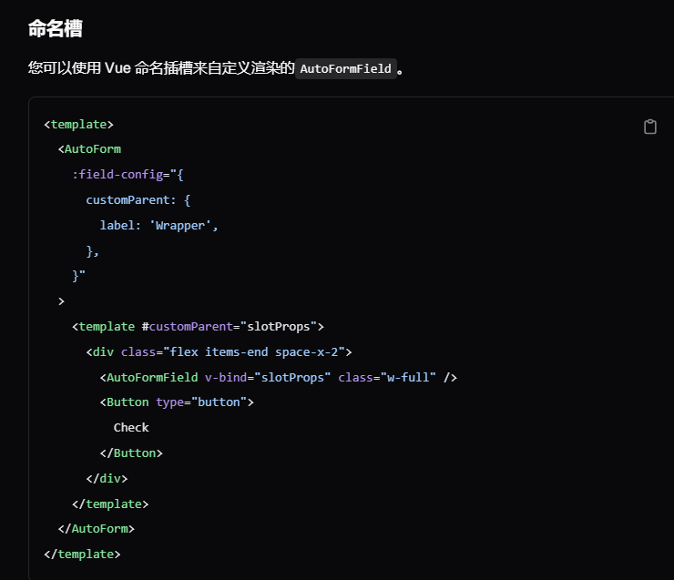

#### 访问表单元素

提交时 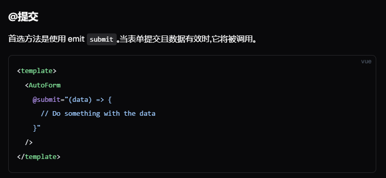

#### 添加到表单下方

传递给AutoForm组件的所有子项都将呈现在表单下方。 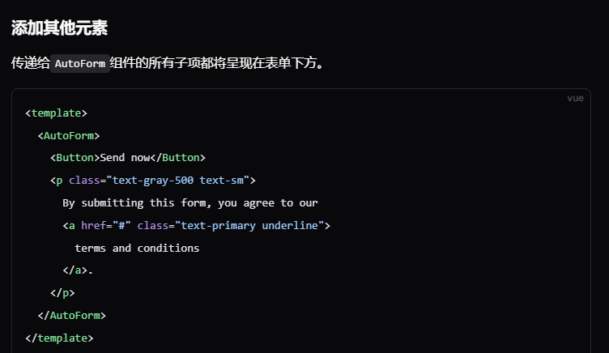

#### 字段依赖

您可以使用该属性来自定义字段依赖。 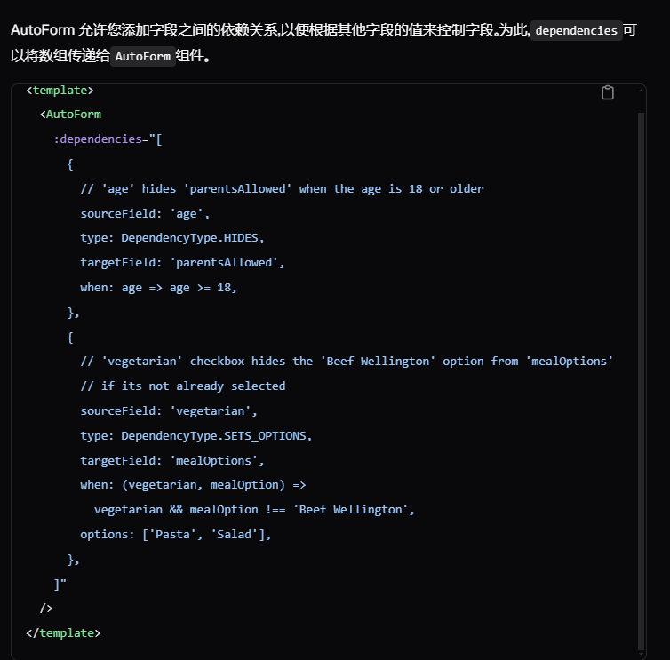 支持的依赖关系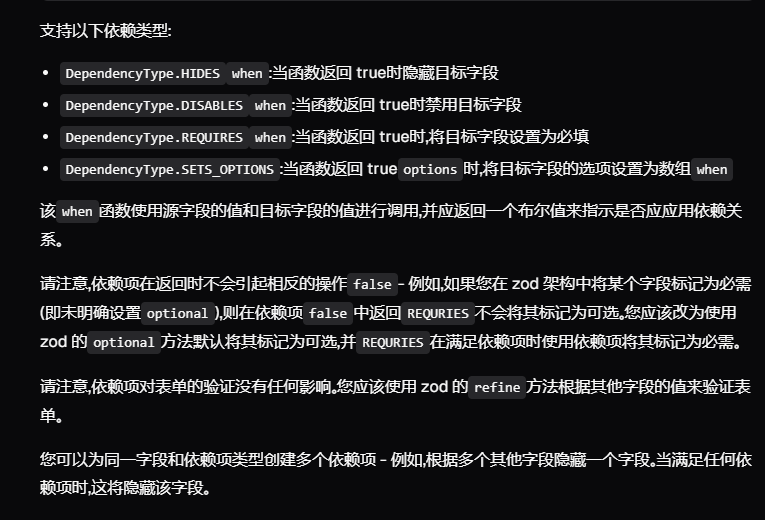

### 示例

```vue
<script setup lang="ts">
import { AutoForm, AutoFormField } from '@/components/ui/auto-form';
import { Button } from '@/components/ui/button';
import { toast } from '@/components/ui/toast';
import { h } from 'vue';
import * as z from 'zod';

enum Sports {
  Football = 'Football/Soccer',
  Basketball = 'Basketball',
  Baseball = 'Baseball',
  Hockey = 'Hockey (Ice)',
  None = "I don't like sports",
}

const schema = z.object({
  username: z
    .string({
      required_error: 'Username is required.',
    })
    .min(2, {
      message: 'Username must be at least 2 characters.',
    }),

  password: z
    .string({
      required_error: 'Password is required.',
    })
    .min(8, {
      message: 'Password must be at least 8 characters.',
    }),

  favouriteNumber: z.coerce
    .number({
      invalid_type_error: 'Favourite number must be a number.',
    })
    .min(1, {
      message: 'Favourite number must be at least 1.',
    })
    .max(10, {
      message: 'Favourite number must be at most 10.',
    })
    .default(1)
    .optional(),

  acceptTerms: z.boolean().refine((value) => value, {
    message: 'You must accept the terms and conditions.',
    path: ['acceptTerms'],
  }),

  sendMeMails: z.boolean().optional(),

  birthday: z.coerce.date().optional(),

  color: z.enum(['red', 'green', 'blue']).optional(),

  // Another enum example
  marshmallows: z.enum(['not many', 'a few', 'a lot', 'too many']),

  // Native enum example
  sports: z.nativeEnum(Sports).describe('What is your favourite sport?'),

  bio: z
    .string()
    .min(10, {
      message: 'Bio must be at least 10 characters.',
    })
    .max(160, {
      message: 'Bio must not be longer than 30 characters.',
    })
    .optional(),

  customParent: z.string().optional(),

  file: z.string().optional(),
});

function onSubmit(values: Record<string, any>) {
  toast({
    title: 'You submitted the following values:',
    description: h(
      'pre',
      { class: 'mt-2 w-[340px] rounded-md bg-slate-950 p-4' },
      h('code', { class: 'text-white' }, JSON.stringify(values, null, 2))
    ),
  });
}
</script>

<template>
  <AutoForm
    class="w-2/3 space-y-6"
    :schema="schema"
    :field-config="{
      password: {
        label: 'Your secure password',
        inputProps: {
          type: 'password',
          placeholder: '••••••••',
        },
      },
      favouriteNumber: {
        description: 'Your favourite number between 1 and 10.',
      },
      acceptTerms: {
        label: 'Accept terms and conditions.',
        inputProps: {
          required: true,
        },
      },

      birthday: {
        description: 'We need your birthday to send you a gift.',
      },

      sendMeMails: {
        component: 'switch',
      },

      bio: {
        component: 'textarea',
      },

      marshmallows: {
        label: 'How many marshmallows fit in your mouth?',
        component: 'radio',
      },

      file: {
        label: 'Text file',
        component: 'file',
      },
    }"
    @submit="onSubmit"
  >
    <template #acceptTerms="slotProps">
      <AutoFormField v-bind="slotProps" />
      <div class="!mt-2 text-sm">
        I agree to the
        <button class="text-primary underline">terms and conditions</button>.
      </div>
    </template>

    <template #customParent="slotProps">
      <div class="flex items-end space-x-2">
        <AutoFormField v-bind="slotProps" class="w-full" />
        <Button type="button"> Check </Button>
      </div>
    </template>

    <Button type="submit"> Submit </Button>
  </AutoForm>
</template>
```
