## 构建可部署的到 CDN Edges 上运行的后端服务

使用的后端框架为**hono**，可通过此框架直接部署后端服务，不需要服务器，

**注意：**1.使用该框架只能使用**es6**的语法，不能使用 **CommonJs**，

2.vercel部署返回的域名会被墙，所以要通过自己的域名解析到什么

### hono介绍

和express差不多是一个简单的web框架，但是可以通过cdn edges上跑，这就说明了可以通过vercel或者其他的边缘计算平台部署

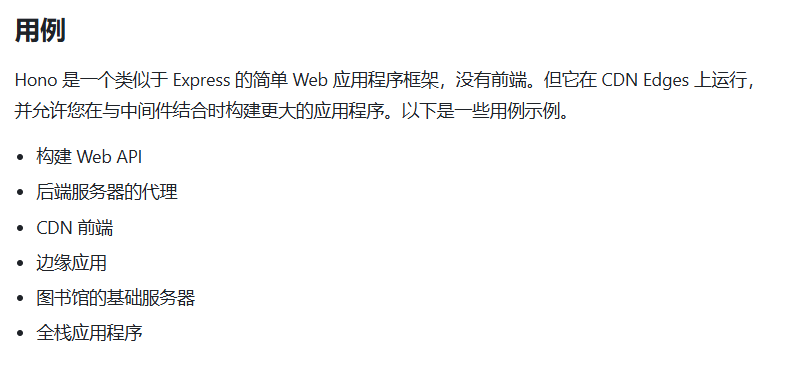

**相应的特征优势**：

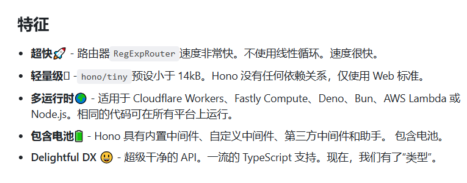

#### **使用示例（vercel部署）：**

初始化后端服务hono提供了vercel的模板 **pnpm create hono my-app**

选择vercel

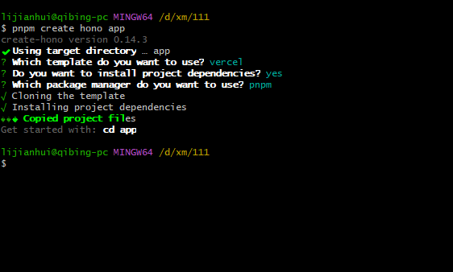

该文件为入口文件，vercel通过读取整个文件进行项目部署

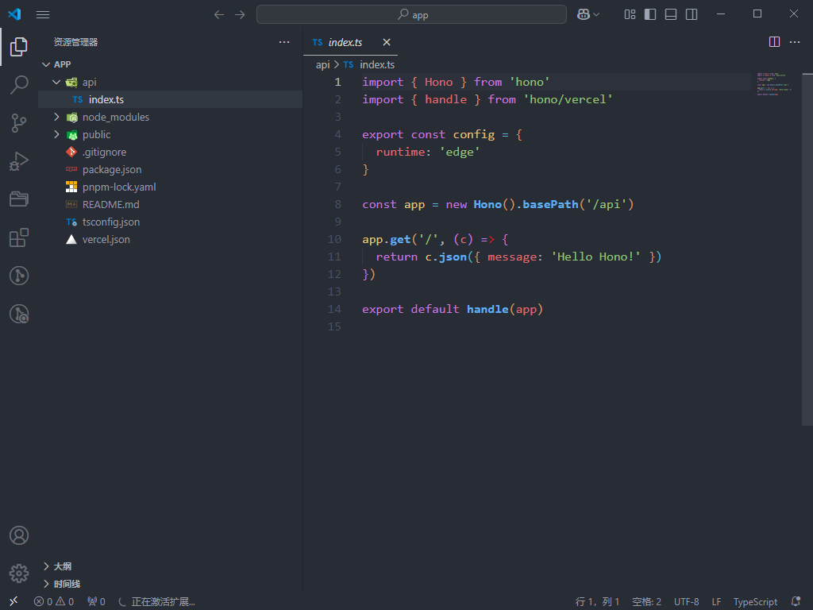

**编写路由和express的写法差不多**

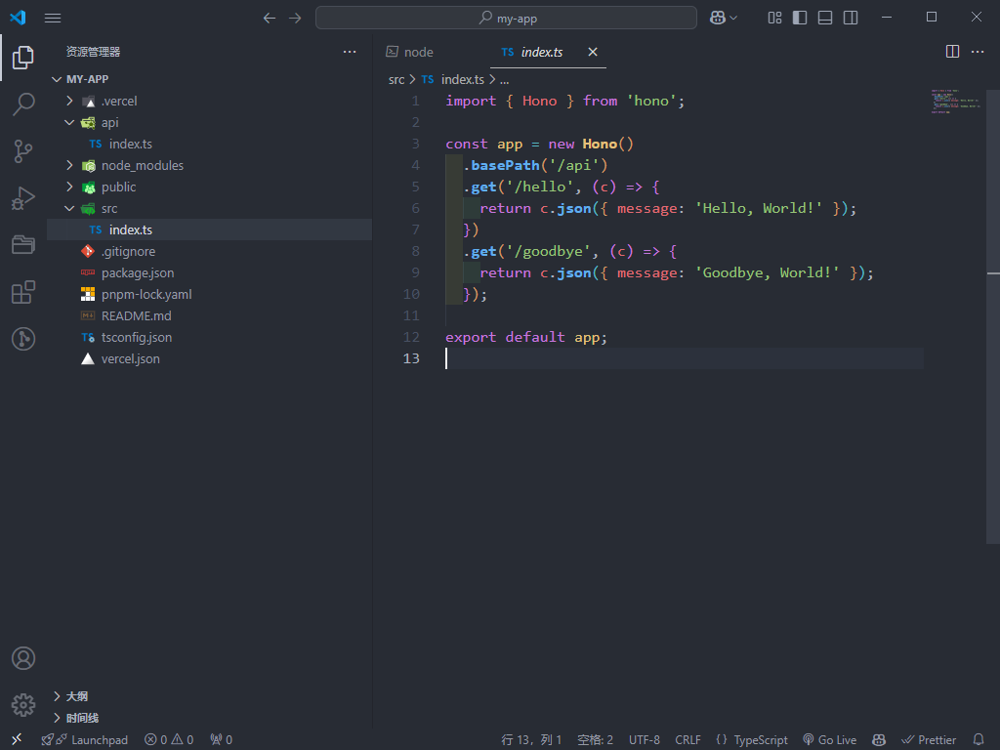

在命令行中的start就是本地开发使用的，deploy就可直接部署到vercel中

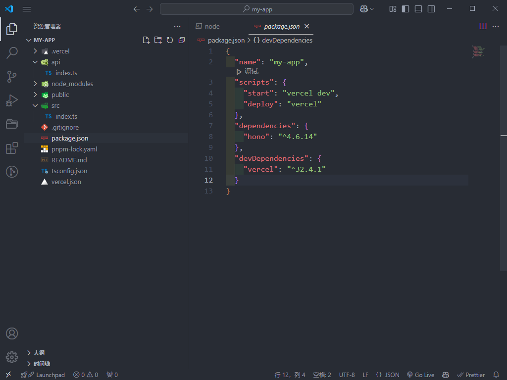

使用start后配置vercel配置，一直点回车就行，就可在本地跑

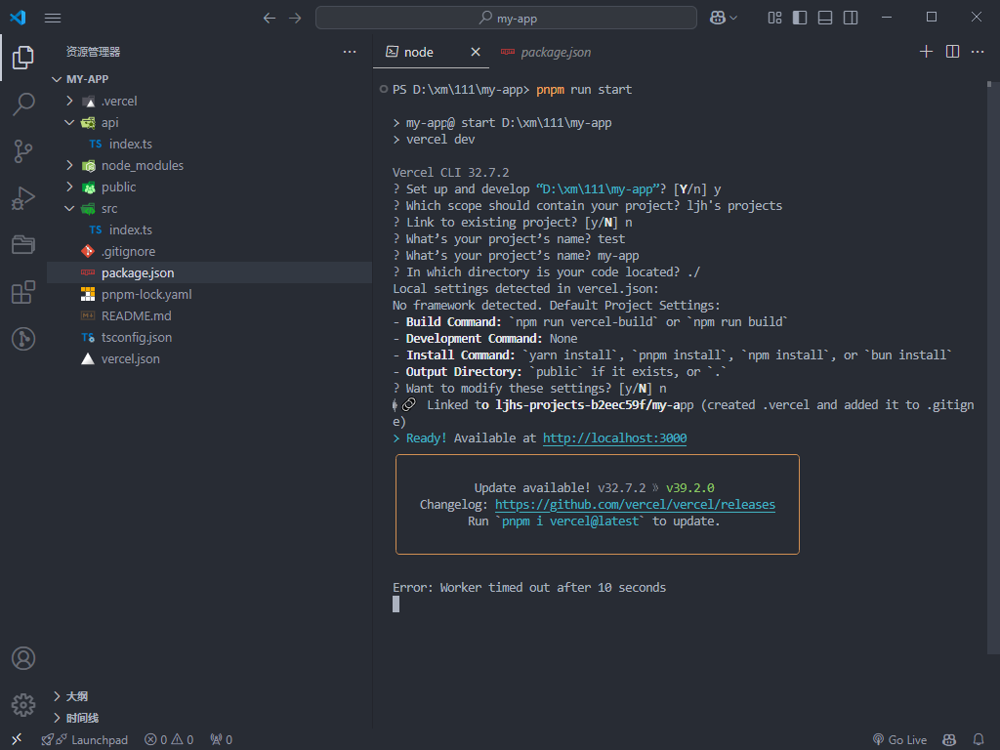

本地服务访问

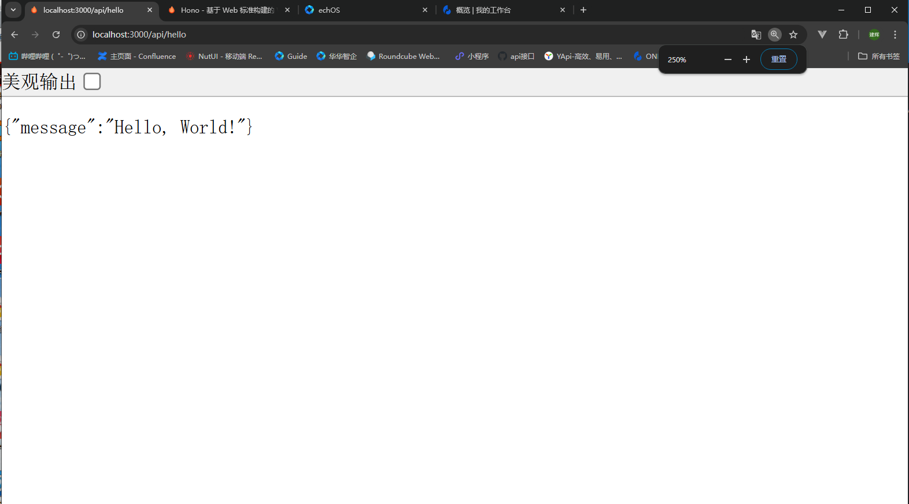

通过deploy部署后，vercel会返回一个域名，通过这个域名访问但是该域名会被墙，所以需要通过自己的域名解析

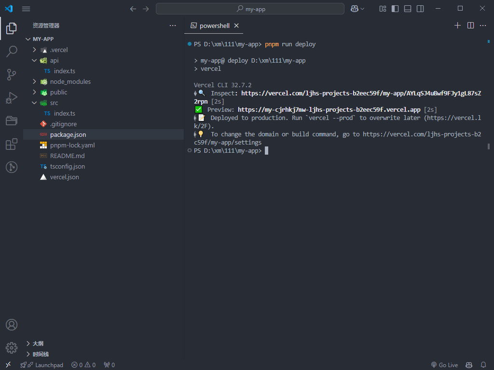

登录到vercel，可看刚刚部署的后端服务

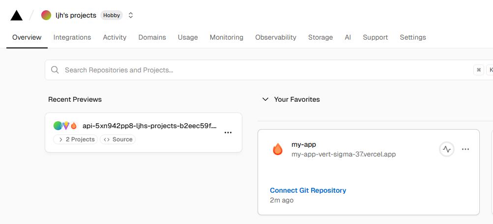

点击这个项目的设置

可以在这里解析域名管理和修改环境变量（比如数据库的连接）

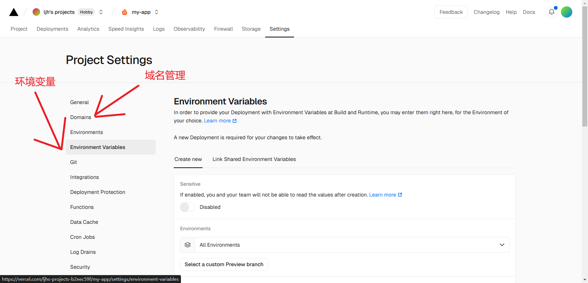

配置域名解析

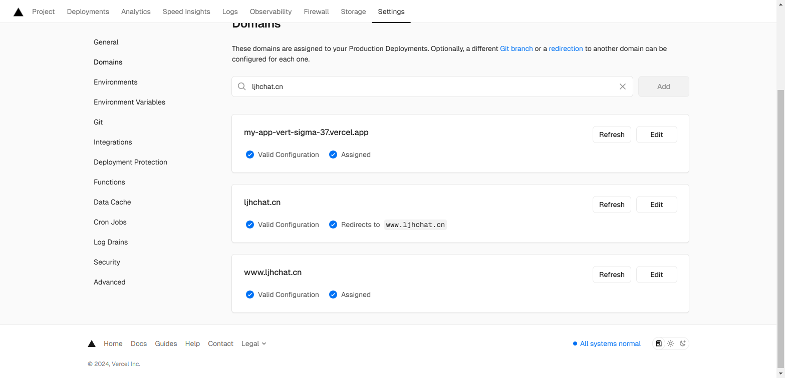

可直接通过域名访问到该后端服务

配置跨域的core，hono提供了他们的中间键来处理

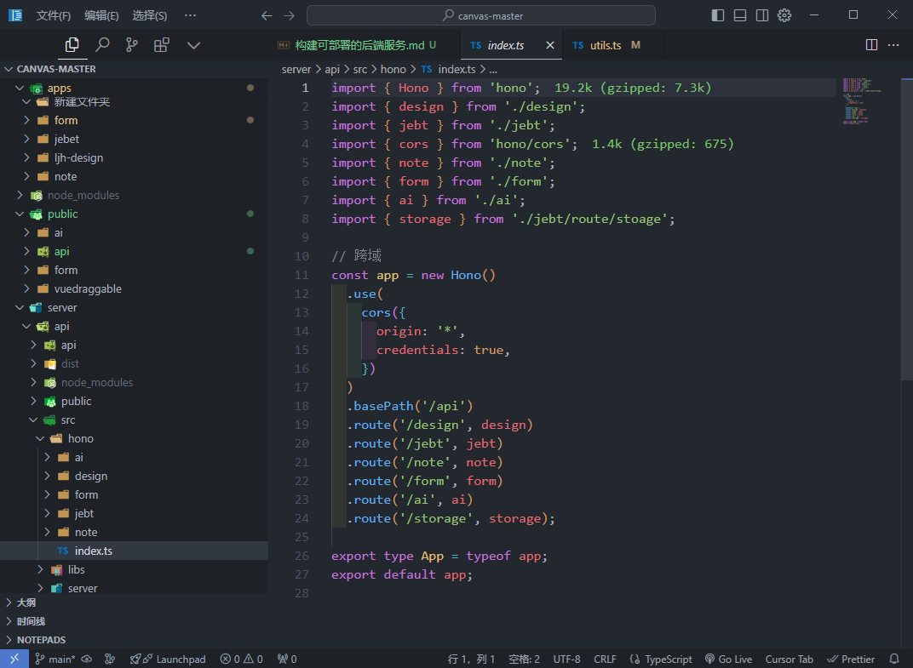

#### 扩展：

本地环境变量可直接添加到.env即可，但是部署还是要去vercel添加环境变量

