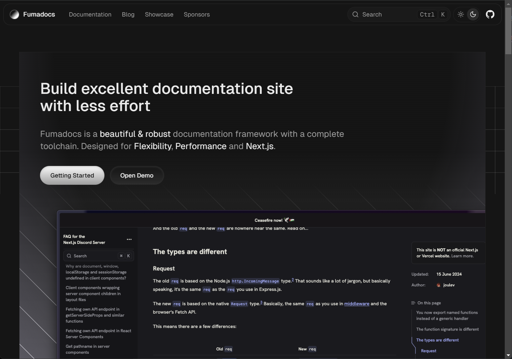
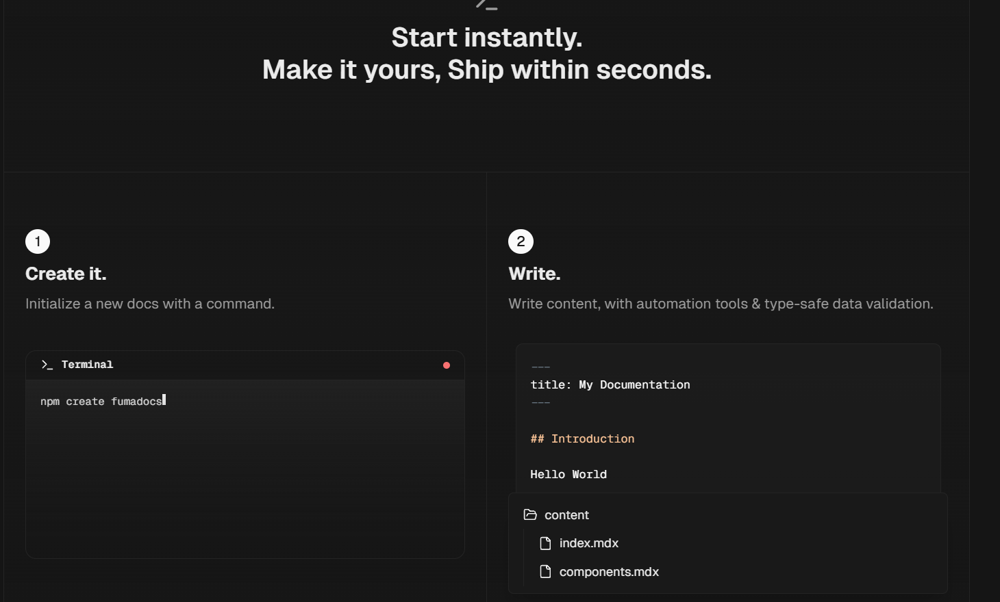
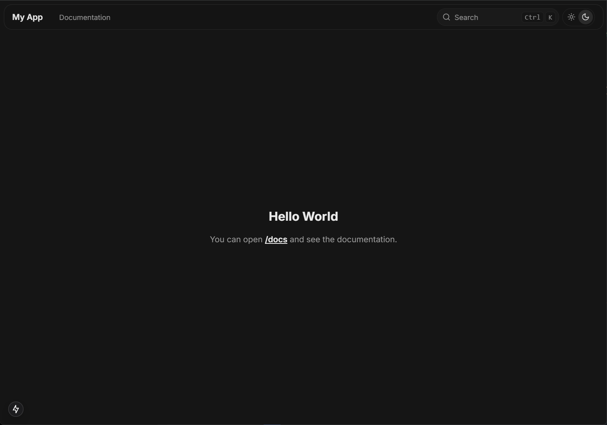
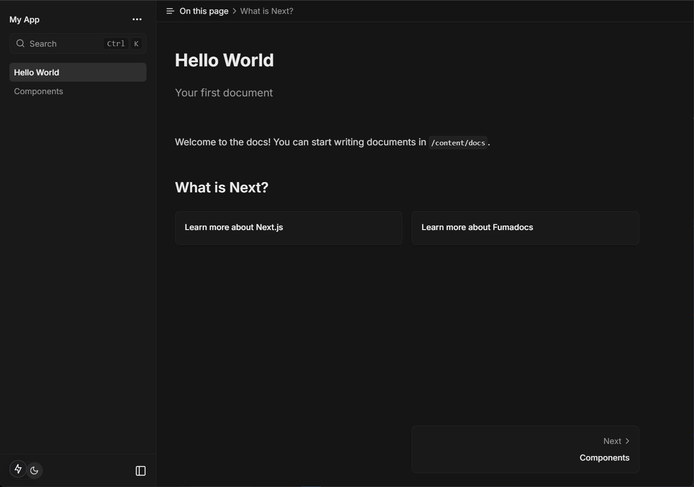
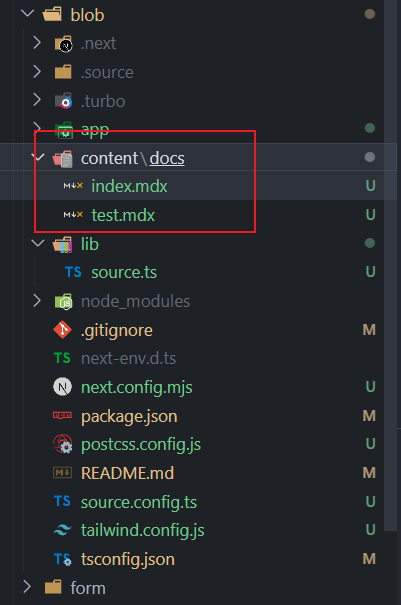

### Fumadocs

Fumadocs 将您的md转换为数据 - 让您可以非常轻松地在应用中导入 MD(X) 和 CMS 内容

### 步骤

### 安装模板即可使用

 使用自动化工具和类型安全的数据验证编写内容。

### 直接使用`pnpm run dev`即可

#### 在docs路径即可看到

#### 页面对应数据对应content里面的md文件

### 方案2：nextra 生成next的静态页面 