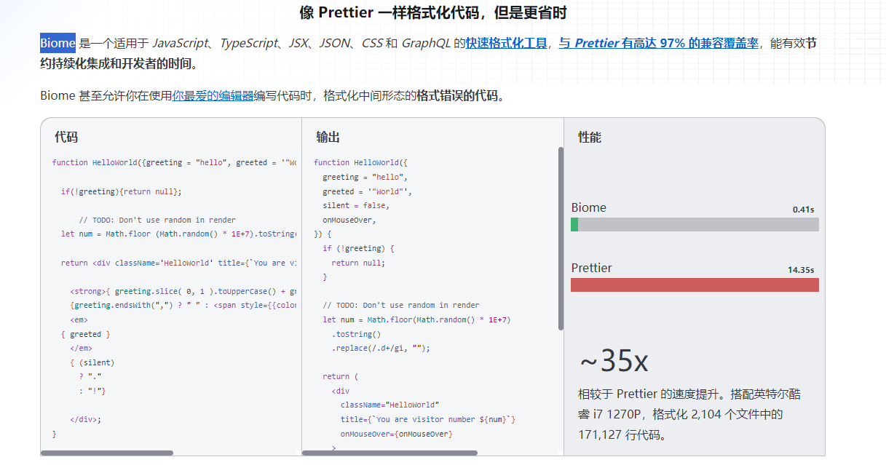
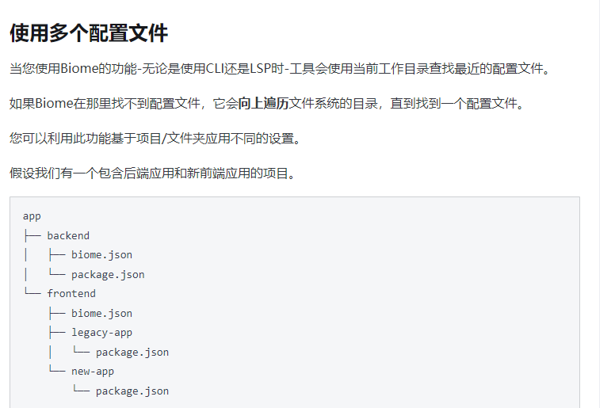

# 统一仓库的检验，并在提交时进行校验

## 基于biome实现的代码格式和代码检验（结合了eslint + prettier）

像 Prettier 一样格式化代码，但是更省时

所以只要放在一个地方即可引用 

---

## git提交hook的进行校验

### husky

husky为我们提供了一系列的git hooks，用于在进行git操作时的一些预处理等等

### lint-staged(使用)

专门用于在通过 git 提交代码之前，对暂存区的代码执行一系列的格式化

### simple-git-hooks（公司使用的就是这个，使用）用这个代替husky

简易Git钩子是一款轻量级的Git钩子管理器，可以在提交或推送时自动执行自定义脚本，如格式化代码、运行测试或检查代码质量等。配合lint-staged使用

## 样式的格式化

### stylelint

