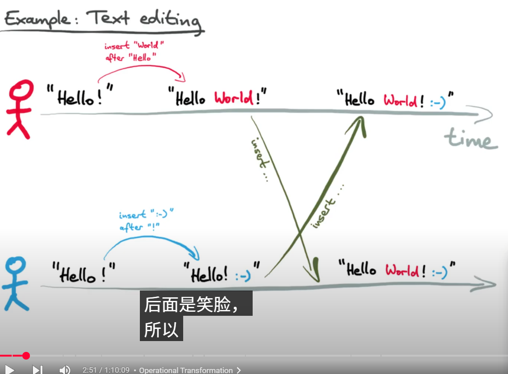
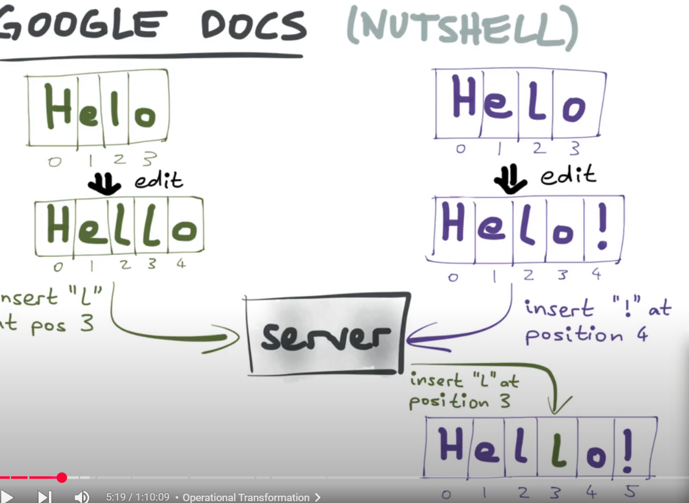
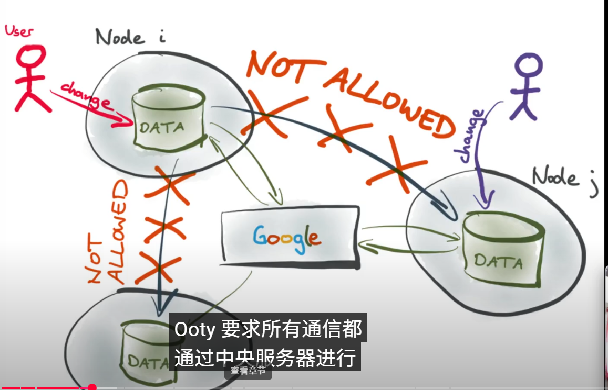
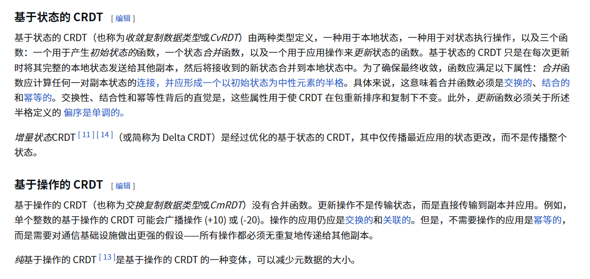
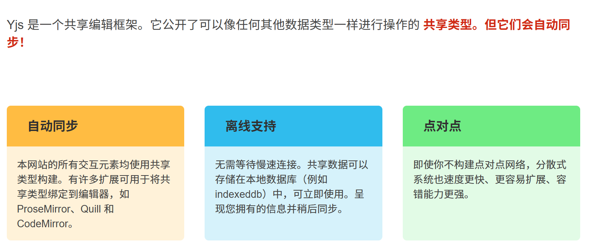

# 防冲突算法

实现结果的最终一致性

### 冲突的出现(编辑器)

出现了两种的冲突解决算法

#### OT (Operational Transformation)操作转换 1989年提出谷歌文档

每一次修改都看作是一个操作，然后将这些操作（索引和位置）进行转换来合并，最终得到文档内容只是对操作进行转发

缺点：OT算法都需要相同的中央服务器来执行操作 

#### CRDT (Conflict-free Replicated Data Type) 无冲突复制数据类型 2006年提出

可更改不同的操作顺序，最终得到相同的结果。

CRDT的不同的算法类型

**基于状态的 CRDT**只是在每次更新时将其完整的本地状态发送给其他副本，然后将接收到的新状态合并到本地状态中。

**基于操作的 CRDT** 更新操作不是传输状态，而是直接传输到副本并应用。

/// 维基百科

这两种方案在理论上是等价的，因为它们可以互相模仿， 然而，在实际中存在差异。基于状态的 CRDT 通常更易于设计和实现；它们对通信基础的唯一要求是某种八卦协议。它们的缺点是每个 CRDT 的整个状态最终都必须传输给其他每个副本，这可能是昂贵的。相反，基于操作的 CRDT 只传输更新操作，这些操作通常很小。然而，基于操作的 CRDT 需要通信中间件的保证；操作在传输到其他副本时不会被丢弃或重复，并且它们是按因果顺序传递的。

虽然基于操作的 CRDT 对在副本之间传输操作的协议提出了更多要求，但当交易数量与内部状态的大小相比较小时，它们使用的带宽比基于状态的 CRDT 要少。但是，由于基于状态的 CRDT 合并函数是关联的，因此与某个副本的状态合并会产生对该副本的所有先前更新。Gossip协议非常适合将基于状态的 CRDT 状态传播到其他副本，同时减少网络使用并处理拓扑变化。已知基于状态的 CRDT 的存储复杂度的 一些下限 。

### YJS 的好处

- 基于操作的同步：Yjs通过操作的传播和应用来实现数据的同步，这使得它在网络不稳定或离线的情况下仍能有效工作。
- 高效的冲突解决：通过 CRDT 的特性，Yjs 能够自动解决数据冲突，而不需要用户干预。
- 增量更新：Yjs 支持增量更新，这意味着只需要同步变化的部分，而不是整个数据集。
- 去中心化：Yjs 不依赖于中心服务器，支持点对点的直接通信。

Yjs的CRDT算法属于基于操作的CRDT。在Yjs中，更新操作是通过传输操作本身而不是传输整个状态来实现的。这种方法允许在不同副本之间高效地同步数据，并自动解决冲突。
